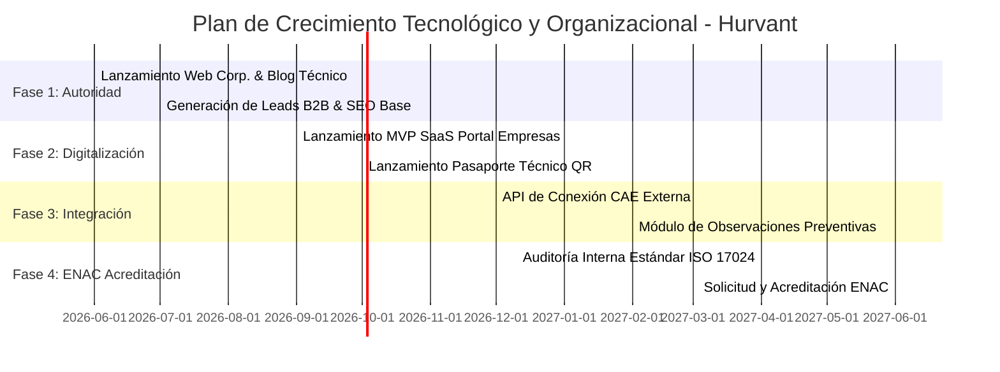

# Hurvant | Arquitectura de Información, Estrategia de Contenidos y Posicionamiento Técnico

Este documento define la base estratégica, el tono editorial (copywriting), la arquitectura de la información (sitemap), la experiencia de usuario (UX) de los portales interactivos y el sistema de diseño visual para **Hurvant**, concebida como una entidad técnica de vanguardia especializada en la validación operativa, verificación documental, evaluación de competencias y PRL con un enfoque de cumplimiento de alta exigencia.

El objetivo de esta arquitectura es posicionar a **Hurvant** como un referente de rigor e imparcialidad técnica en el mercado español, proyectando una visión alineada con estándares de acreditación internacional (como ISO/IEC 17024 e ISO/IEC 17020), pero respetando escrupulosamente el marco regulatorio actual sin incurrir en publicidad engañosa.

---

## 1. Enfoque del Copy y Posicionamiento Estratégico

El éxito comercial y legal de Hurvant radica en su capacidad de diferenciarse de una consultora de prevención tradicional o una academia de formación. Se debe proyectar la imagen de una **entidad de tercera parte**, rigurosa, digitalizada y orientada a mitigar la responsabilidad penal y civil de los administradores de empresas.

### 1.1. Principios de Posicionamiento

*   **Tercera Parte Imparcial:** Presentarse como un evaluador externo que audita y valida con criterios objetivos. No "ayudamos a redactar el plan" (consultoría ordinaria), sino que "evaluamos y testamos la eficacia operativa de los controles y competencias" (validación técnica).
*   **Enfoque de Compliance y Mitigación de Riesgo Legal:** El lenguaje debe apelar a directores de compras, directores de recursos humanos, responsables de HSE (Salud, Seguridad y Medio Ambiente) y asesores jurídicos corporativos. La propuesta de valor es la **evidencia trazable ante inspecciones de trabajo o procesos judiciales**.
*   **Alineamiento Metodológico:** Aunque no se posea la acreditación de ENAC en esta fase inicial, toda la estructura organizativa, documental y procedimental debe diseñarse bajo los estándares de las normas **UNE-EN ISO/IEC 17024** (para certificación de personas) y **UNE-EN ISO/IEC 17020** (para entidades de inspección). Esto facilita una transición directa a la acreditación formal en fases posteriores.

### 1.2. Diccionario de Términos: Qué usar y qué evitar

Para evitar sanciones de la Comisión Nacional de los Mercados y la Competencia (CNMC) y mantener un posicionamiento honesto pero sumamente riguroso, se establece el siguiente control de vocabulario:

| 🚫 TÉRMINOS A EVITAR | ️✅ ALTERNATIVAS TÉCNICAS A USAR | JUSTIFICACIÓN TÉCNICA / LEGAL |
| :--- | :--- | :--- |
| "Certificación oficial" / "Homologado ENAC" | **"Evaluación bajo estándares alineados con ISO 17024"** / **"Esquemas propios de validación técnica"** | Evita la suplantación de entidades formalmente acreditadas por ENAC, pero posiciona el servicio bajo la misma estructura metodológica internacional. |
| "Curso de formación" / "Academia de prevención" | **"Esquema de evaluación de competencias"** / **"Validación operativa práctica"** | La formación tradicional tiene una connotación de bajo valor y nula verificación real. Hurvant se enfoca en verificar si el trabajador *sabe operar de forma segura en la realidad*, no en si asistió a una charla. |
| "Acreditado" / "Organismo de Control Autorizado (OCA)" | **"Entidad técnica independiente de tercera parte"** / **"Validación de conformidad operativa"** | Reserva el concepto de OCA para las inspecciones reglamentarias obligatorias del Ministerio de Industria, situando a Hurvant en el plano del *compliance voluntario de alta exigencia*. |
| "Aprobado" | **"Evidencia técnica de aptitud operativa"** / **"Criterio de conformidad alcanzado"** | Transmite que el resultado se basa en datos y pruebas objetivas documentadas, no en un juicio subjetivo o un examen teórico trivial. |
| "Diploma de asistencia" | **"Certificado de competencia operativa emitida por entidad técnica"** | Enfatiza que el documento emitido requiere una evaluación de habilidades prácticas reales y documentadas con trazabilidad digital. |

### 1.3. Tono y Voz de la Marca

*   **Rigor Científico y Técnico:** La redacción debe ser precisa, estructurada y basada en normativas técnicas (e.g., Reales Decretos, directivas europeas, normas UNE/ISO).
*   **Orientación Tecnológica:** Evitar el papel, el desorden y la burocracia. El copy debe resaltar conceptos como *trazabilidad digital en tiempo real*, *encriptación de evidencias*, *código QR de validación en campo* e *indicadores predictivos*.
*   **Seguridad Jurídica:** Usar términos que den tranquilidad a los departamentos legales de los clientes (e.g., *diligencia debida*, *trazabilidad de la evidencia*, *descargo de responsabilidad corporativa*, *mitigación del riesgo operacional*).

---

## 2. Estructura Completa de la Web (Sitemap)

Para proyectar una entidad robusta y estructurada, el sitemap se diseña de manera jerárquica, asegurando la indexación SEO de cada servicio y sector, a la vez que se provee un acceso intuitivo a las herramientas operativas.

```mermaid
graph TD
    A[Home - Hurvant] --> B[Servicios]
    A --> C[Sectores]
    A --> D[Metodología de Tercera Parte]
    A --> E[Áreas Privadas]
    A --> F[Autoridad Técnica]
    A --> G[Gobernanza e Imparcialidad]
    A --> H[Contacto Corporativo]

    B --> B1[Certificación de Personas ISO 17024 Concept]
    B --> B2[PRL Moderna y Cultura Preventiva]
    B --> B3[Validación Operativa de Maquinaria]
    B --> B4[Verificación Documental Avanzada]
    B --> B5[Coordinación de Actividades Empresariales CAE]
    B --> B6[Evaluación de Competencias Profesionales]
    B --> B7[Observación Preventiva en Campo]
    B --> B8[Informes Técnicos de Trazabilidad]

    C --> C1[Logística y Distribución]
    C --> C2[Construcción e Infraestructura]
    C --> C3[Industria Manufacturera y Metalúrgica]
    C --> C4[Energías Renovables]
    C --> C5[Sector Agroalimentario]

    D --> D1[Alineamiento con Estándares UNE-EN]
    D --> D2[Trazabilidad de la Evidencia Técnica]

    E --> E1[Portal Clientes - Dashboard Empresa]
    E --> E2[Portal Trabajadores - Pasaporte de Competencias]

    F --> F1[Blog Técnico de Compliance]
    F --> F2[Whitepapers & Guías de Inspección]

    G --> G1[Comité de Imparcialidad]
    G --> G2[Canal Ético y de Denuncias]
    G --> G3[Política de Calidad y Confidencialidad]
```



### Detalle de las Secciones del Sitemap

1.  **Home (Página Principal):** Presentación del ecosistema Hurvant. Propuesta de valor: "Rigor técnico y validación operativa con trazabilidad documental instantánea". Visualización tipo panel de control híbrido con estadísticas de mercado y acceso directo a la verificación de certificados por código QR.
2.  **Servicios (8 Fichas Individuales de Alta Densidad Informativa):** Páginas específicas estructuradas para capturar búsquedas de intención de compra (B2B).
3.  **Sectores (5 Páginas Sectoriales):** Enfoque directo a la problemática operativa de cada industria en España.
4.  **Metodología y Trazabilidad:** Explicación técnica de cómo Hurvant realiza la recogida de evidencias operativas en campo (foto/video verificado, geolocalización, firma digital) para asegurar que cada certificado emitido tiene respaldo judicial.
5.  **Área Cliente (SaaS Corporativo):** Landing explicativa del portal de clientes con capturas simuladas del dashboard de alta tecnología, invitando al registro corporativo.
6.  **Área Trabajador (Pasaporte Técnico):** Explicación del funcionamiento del "Pasaporte de Competencias" mediante QR para operarios en campo.
7.  **Gobernanza y Calidad:** Apartado crítico para simular una estructura tipo ENAC. Contiene la composición del Comité de Imparcialidad (externo), la Declaración de Imparcialidad del CEO y los procedimientos de reclamación y apelación de dictámenes.
8.  **Blog y Autoridad Técnica:** Espacio editorial especializado en normativas, sentencias judiciales de PRL, compliance y gestión de riesgos.
9.  **Contacto y Solicitud de Auditoría:** Formulario técnico detallado donde el cliente no pide un "presupuesto" genérico, sino que introduce variables operativas (número de plantas, tipología de maquinaria, volumen de trabajadores subcontratados).

---

## 3. Desarrollo Fino de Servicios Principales (Enfoque Comercial y SEO)

Para que cada servicio resulte comercialmente atractivo y se posicione orgánicamente en Google España, debe estructurarse como una "Ficha Técnica de Solución". Evitaremos descripciones vagas de texto continuo y utilizaremos una estructura sistemática:
*   **El Desafío de Cumplimiento (Dolor del Cliente):** Qué le preocupa a la empresa (sanciones, accidentes graves, responsabilidad solidaria/subsidiaria, recargo de prestaciones).
*   **Criterio Técnico y Normativa de Referencia:** Qué leyes o estándares de calidad respaldan la evaluación (e.g., Ley 31/1995 de PRL, RD 1215/1997 de Equipos de Trabajo).
*   **Metodología de Validación Hurvant:** Cómo auditamos de forma objetiva (evidencias tangibles).
*   **El Entregable Técnico:** Qué recibe el cliente (Certificado de Aptitud Operativa, Informes Técnicos con trazabilidad digital, matriz de competencias).

A continuación se desarrolla el contenido estratégico de los servicios prioritarios:

---

### 3.1. Certificación y Validación de Personas (Alineada con ISO 17024)

*   **Enfoque Comercial:** El 90% de los accidentes graves con maquinaria se deben a una formación teórica deficiente o a una falta de evaluación práctica real. Hurvant no emite "diplomas de haber asistido a un curso". Emitimos una **certificación técnica de competencia operativa de personas** basada en un examen riguroso de habilidades prácticas en el puesto de trabajo.
*   **Enfoque SEO:** Palabras clave como *evaluación de competencias operativas*, *certificación de operadores de maquinaria*, *validación de aptitud laboral práctica*, *esquemas de certificación ISO 17024 España*.
*   **Estructura del Servicio:**
    *   **Paso 1: Definición del Perfil de Competencia:** Alineación con el estándar del sector o diseño a medida para la empresa.
    *   **Paso 2: Evaluación Práctica Rigurosa:** Un examinador técnico de Hurvant evalúa al operario en su entorno real de trabajo mediante listas de control objetivas estructuradas en tabletas digitales.
    *   **Paso 3: Emisión de Certificado con Trazabilidad QR:** En caso de conformidad, se genera un certificado digital con código QR de verificación pública inmediata.
    *   **Paso 4: Plan de Mantenimiento de Competencia:** Alertas automáticas ante la necesidad de reevaluación periódica.

---

### 3.2. PRL Moderna y Cultura Preventiva Integrada

*   **Enfoque Comercial:** Romper con la PRL de "papeleo archivado que nadie lee". Ayudamos a las empresas a auditar la implantación efectiva de su servicio de prevención (propio o ajeno). Validamos si las medidas preventivas escritas se ejecutan realmente en la línea de producción o si existe una brecha de cumplimiento de alto riesgo.
*   **Enfoque SEO:** *Auditoría de cultura preventiva*, *evaluación de la eficacia preventiva de campo*, *compliance en prevención de riesgos laborales*, *brecha de cumplimiento PRL España*.
*   **Estructura del Servicio:**
    *   **Diagnóstico de Campo:** Inspección física de las condiciones de trabajo y contraste directo con las evaluaciones de riesgos existentes.
    *   **Auditoría de Comportamientos Seguros:** Medición científica del nivel de cultura preventiva basándonos en metodologías internacionales de seguridad basada en el comportamiento (SBC).
    *   **Cuadro de Mando de Riesgos Legales:** Presentación de un mapa interactivo para el Comité de Dirección que indica exactamente qué departamentos o centros tienen un nivel crítico de exposición legal o de siniestralidad potencial.

---

### 3.3. Evaluación Operativa y Adecuación de Maquinaria (RD 1215/97)

*   **Enfoque Comercial:** Asegurar que los equipos de trabajo (carretillas, plataformas elevadoras, puentes grúa, líneas automatizadas) cumplen estrictamente con las disposiciones del Real Decreto 1215/1997. Ofrecemos informes de validación técnica antes de la puesta en servicio de nuevos equipos o de forma periódica para maquinaria en uso, proporcionando blindaje legal a la dirección.
*   **Enfoque SEO:** *Validación técnica maquinaria RD 1215*, *adecuación de equipos de trabajo*, *informe técnico de seguridad maquinaria*, *inspección de conformidad de equipos industriales*.
*   **Estructura del Servicio:**
    *   **Inspección Detallada:** Verificación de resguardos, mandos de seguridad, paradas de emergencia, señalización y documentación del fabricante.
    *   **Pruebas de Funcionamiento Dinámicas:** Evaluación de los sistemas de seguridad en condiciones de carga e interacción con el operario.
    *   **Informe de Defectos y Plan de Acción:** Listado priorizado por nivel de criticidad (Bloqueante, Grave, Leve) con propuestas de medidas correctoras de ingeniería.
    *   **Placa de Validación Física:** Colocación de una placa física con QR en el equipo que certifica que ha superado la evaluación técnica de Hurvant.

---

### 3.4. Verificación Documental Avanzada y CAE (Coordinación de Actividades Empresariales)

*   **Enfoque Comercial:** La subcontratación en España genera una ingente cantidad de documentación CAE que suele ser validada por administrativos sin criterio técnico. Hurvant aporta un equipo de ingenieros y técnicos especializados que auditan la **calidad y veracidad** de la documentación cargada (certificados de aptitud reales, acreditaciones específicas, adecuación de equipos subcontratados).
*   **Enfoque SEO:** *Auditoría documental CAE*, *verificación técnica de subcontratistas*, *gestión de cumplimiento documental empresarial*, *trazabilidad documental subcontratas*.
*   **Estructura del Servicio:**
    *   **Cero "Aprobados Automáticos":** Verificación exhaustiva de firmas, vigencias, registros oficiales y contenido técnico de las evaluaciones de riesgos concurrentes.
    *   **Validación de Habilitación Profesional:** Comprobación sistemática de que los técnicos y operarios externos disponen de los registros y habilitaciones oficiales pertinentes.
    *   **Alertas Predictivas:** Notificación al cliente de desajustes documentales de proveedores críticos semanas antes de que accedan a sus instalaciones.

---

### 3.5. Observación Preventiva y Registro de Evidencias en Campo

*   **Enfoque Comercial:** La mejor defensa legal es la posesión de pruebas objetivas que demuestren que la empresa ejerce una labor activa de supervisión y control sobre sus operarios y contratas. Hurvant provee un servicio sistemático de **Observaciones Preventivas del Trabajo (OPT)**, ejecutadas por técnicos expertos que registran comportamientos, condiciones físicas e interacciones operativas mediante una metodología digital de trazabilidad infranqueable.
*   **Enfoque SEO:** *Observaciones preventivas del trabajo OPT*, *auditoría de comportamientos seguros*, *registro digital de evidencias de seguridad*, *supervisión técnica en obra y planta*.
*   **Estructura del Servicio:**
    *   **Planificación de Visitas Inopinadas:** Observaciones en campo sin aviso previo para capturar la realidad del comportamiento operativo.
    *   **Registro Multimodal de Evidencias:** Captura mediante aplicación móvil de fotografías geolocalizadas, grabaciones de voz y firmas en pantalla de los supervisados.
    *   **Informe Técnico de Diligencia Debida:** Generación automática de un dossier técnico que demuestra la labor de control del empresario ante cualquier requerimiento de la Inspección de Trabajo.

---

## 4. Área Cliente (SaaS) y Área Trabajador (Pasaporte Técnico)

Este apartado conceptualiza el núcleo tecnológico de Hurvant, alejándola de una consultora tradicional y presentándola como una plataforma digital escalable de alto valor tecnológico.

### 4.1. Portal de Empresas (Dashboard de Compliance y Trazabilidad)

Un entorno web privado, con diseño oscuro minimalista de alta tecnología, que permite a los responsables de compras, HSE y dirección general controlar en tiempo real el estado de su ecosistema operativo.

#### Funcionalidades Clave del Portal de Empresas

1.  **Matriz de Competencias del Personal (Skill Matrix en Tiempo Real):** Un panel visual que muestra a cada empleado y su nivel de validación operativa en tiempo real (Color Verde: Validado; Naranja: Próximo a vencer; Rojo: No apto/Bloqueado).
2.  **Gestión de Evidencias de Maquinaria:** Expediente digital único de cada máquina en planta o almacén con sus informes técnicos RD 1215, actas de mantenimiento y el QR de trazabilidad asociado.
3.  **Módulo CAE Inteligente:** Pantalla de control de contratas donde se visualiza el porcentaje de cumplimiento real de cada subcontratista, no solo con un "apto/no apto", sino con un índice de calidad documental.
4.  **Buzón de Informes Técnicos Firmados Digitalmente:** Repositorio inmutable que aloja todas las auditorías, OPT y actas de examen emitidas por Hurvant, con huella digital hash para garantizar su inalterabilidad ante tribunales.
5.  **Notificaciones de Vencimientos Automatizados:** Sistema de alertas multicanal (Email, SMS) que avisa del vencimiento inminente de validaciones de operarios o adecuaciones de maquinaria.

#### Mockup Estructural del Dashboard del Portal de Empresas

```
+-----------------------------------------------------------------------------------------+
|  HURVANT | Portal Corporativo               [Buscar operario, máquina o informe...]  (👤) |
+-----------------------------------------------------------------------------------------+
| [⚡ Inicio]      | PANEL DE CONTROL GENERAL - COMPLIANCE OPERATIVO                       |
| [👥 Personal]    |                                                                       |
| [🚜 Equipos]     |  +-------------------+  +-------------------+  +-------------------+  |
| [📄 Informes]    |  | ÍNDICE DE APTITUD |  | CONTROL MAQUINARIA|  | ALERTAS CAE       |  |
| [🔧 Ajustes]     |  |      94.2%        |  | 42 / 45 Equipos   |  | 3 Subcontratas    |  |
|                  |  |  (Cumplimiento)   |  |   Adecuados       |  |  con Incidencias  |  |
|                  |  +-------------------+  +-------------------+  +-------------------+  |
|                  |                                                                       |
|                  |  ÚLTIMAS VALIDACIONES EMITIDAS                                        |
|                  |  +-----------------------------------------------------------------+  |
|                  |  | Operario        | Competencia Validada       | Estado  | Trazab. |  |
|                  |  +-----------------+----------------------------+---------+---------+  |
|                  |  | Carlos Gómez    | Operador Carretilla Tipo 4 | ACTIVO  | [QR-Ver]|  |
|                  |  | Marta Ruiz      | Espacios Confinados Cat. C | ACTIVO  | [QR-Ver]|  |
|                  |  | Jorge Benítez   | Trabajos en Altura Telco   | VENCIDO | [Alerta]|  |
|                  |  +-----------------------------------------------------------------+  |
|                  |                                                                       |
|                  |  AUDITORÍAS OPERATIVAS RECIENTES                                      |
|                  |  [📄 Informe RD 1215 - Línea de Envasado 3 - Firmado PDF] [Descargar]   |
|                  |  [📄 Acta de Observación Preventiva - Almacén Central]   [Descargar]   |
+-----------------------------------------------------------------------------------------+
```

---

### 4.2. Portal del Trabajador (Pasaporte Técnico de Competencias)

Diseñado específicamente para dispositivos móviles. Cada operario validado por Hurvant posee un perfil digital único que sirve como su acreditación técnica profesional ante clientes y contratas.

#### Funcionalidades Clave del Portal del Trabajador

1.  **Pasaporte Digital de Habilidades (Mobile-First):** Una interfaz limpia optimizada para teléfonos móviles que muestra la fotografía del trabajador y un código QR dinámico de alta seguridad.
2.  **Verificación Pública Segura por QR:** Cuando un coordinador de seguridad (CSS) o el cliente escanea el QR en el campo de trabajo, la web de Hurvant devuelve una página de validación pública simplificada (sin credenciales) que confirma:
    *   Identidad del operario.
    *   Competencias validadas y activas.
    *   Fecha de validez del examen práctico y técnico de Hurvant.
    *   Exclusiones o limitaciones operativas específicas (e.g., "Apto solo para carretillas eléctricas de hasta 3 tn").
3.  **Historial de Desempeño y Observaciones:** Registro transparente de las observaciones preventivas realizadas al trabajador durante su actividad, permitiendo visualizar su evolución en materia de seguridad.
4.  **Repositorio de Evidencias Digitales:** El operario puede descargar la documentación técnica de sus evaluaciones y acceder a material de reciclaje técnico interactivo de alta calidad.

#### Flujo de Experiencia de Usuario (UX) de Verificación en Campo

```
[Operario en Planta] 📱 Muestra su QR del Pasaporte Técnico
        │
        ▼
[Inspector / Responsable CAE] 📸 Escanea el QR con su móvil corporativo
        │
        ▼
[Servidor Hurvant (Página Pública Segura)]
 ┌──────────────────────────────────────────────────────────┐
 │  HURVANT | VERIFICACIÓN INSTANTÁNEA DE APTITUD           |
 │                                                          |
 │  👤 OPERARIO: Gómez Sánchez, Carlos                      |
 │  🏢 EMPRESA: Logística del Norte S.L.                    |
 │                                                          |
 │  ✅ COMPETENCIAS VALIDADAS:                              |
 │  • Carretilla Elevadora Frontal (RD 1215)   - ACTIVA     |
 │  • Transpaleta Eléctrica Operador a Bordo - ACTIVA     |
 │                                                          |
 │  ⚠️ LIMITACIONES / EXCLUSIONES:                           |
 │  • Requiere uso obligatorio de lentes correctoras.       |
 │                                                          |
 │  ⏱️ PRÓXIMA EVALUACIÓN PRÁCTICA: 12/10/2026              |
 │                                                          |
 │  🔒 EVIDENCIA RESPALDADA POR FIRMA DIGITAL HURVANT       |
 └──────────────────────────────────────────────────────────┘
```

---

## 5. Sectores Objetivo en España: Análisis de Demanda y Enfoque Comercial

Para captar clientes corporativos de alto valor de forma inmediata, la web debe hablar el lenguaje operativo y responder a las problemáticas regulatorias específicas de los 5 sectores más dinámicos de la economía española.

### 5.1. Logística, Distribución y Gran Consumo

*   **Problemática Real en España:** Elevada rotación de personal externo por ETT, uso intensivo de maquinaria móvil (carretillas, retráctiles, transpaletas), y alto índice de siniestralidad por atropellos y caída de cargas.
*   **Enfoque Comercial Hurvant:**
    *   Ofrecer esquemas de validación de carretilleros express pero ultra-rigurosos in-situ en el propio almacén del cliente.
    *   Auditar la seguridad de las zonas de tránsito y estanterías conforme a la norma UNE EN 15635.
    *   Implantar un sistema de control de operarios externos mediante el código QR del Pasaporte Técnico, asegurando que ninguna ETT introduzca personal no evaluado en sus instalaciones.

### 5.2. Construcción, Obra Civil e Infraestructuras

*   **Problemática Real en España:** Rigidez del Convenio General del Sector de la Construcción, control de subcontratación en cascada complejo, y gran volumen de maquinaria pesada sin la adecuación de seguridad RD 1215 al día.
*   **Enfoque Comercial Hurvant:**
    *   Validar operativamente a los maquinistas de excavadoras, retroexcavadoras y grúas de forma independiente a los cursos teóricos obligatorios del convenio.
    *   Realizar inspecciones técnicas in-situ de la maquinaria subcontratada antes de su acceso a la obra para evitar la paralización de trabajos por deficiencias de seguridad.
    *   Proporcionar informes técnicos de "diligencia debida" para el Promotor y la Constructora Principal ante posibles inspecciones de trabajo.

### 5.3. Industria Metalúrgica, Química y Manufacturera

*   **Problemática Real en España:** Paradas técnicas de mantenimiento complejas con gran confluencia de contratas, operaciones de alto riesgo (trabajos en altura, espacios confinados, soldadura), e implantación deficiente del sistema LOTO (Lockout/Tagout - Consignación de Máquinas).
*   **Enfoque Comercial Hurvant:**
    *   Certificación interna de operarios de mantenimiento para la realización de trabajos críticos bajo estándares metodológicos rigurosos.
    *   Auditorías operativas de consignación de energías y sistemas LOTO, verificando físicamente la estanqueidad y seguridad de los bloqueos de maquinaria.
    *   Evaluación y testeo de la eficacia real de los planes de emergencia e instalaciones industriales críticas.

### 5.4. Energías Renovables (Eólica y Solar Fotovoltaica)

*   **Problemática Real en España:** Emplazamientos geográficamente aislados, condiciones meteorológicas extremas, subcontratación internacional de perfiles altamente cualificados, y exigencias de los estándares GWO (Global Wind Organisation) o similares.
*   **Enfoque Comercial Hurvant:**
    *   Evaluación técnica práctica del personal de instalación y mantenimiento eólico en trabajos en altura y rescate técnico.
    *   Validación operativa del estado físico de los sistemas de izado y escaleras de servicio de los aerogeneradores de acuerdo con el RD 1215/1997.
    *   Verificación documental y técnica avanzada de empresas subcontratadas extranjeras para asegurar el cumplimiento estricto de la legislación española de subcontratación.

### 5.5. Sector Agroalimentario y Envasado Automatizado

*   **Problemática Real en España:** Alta estacionalidad con picos de contratación masiva, líneas de producción automatizadas complejas con puntos de atrapamiento severos, y necesidad de cumplir con normativas internacionales de calidad alimentaria (IFS, BRC) que exigen control exhaustivo de competencias y proveedores.
*   **Enfoque Comercial Hurvant:**
    *   Certificación práctica de competencias del personal temporal para líneas automatizadas complejas.
    *   Evaluación operativa de los resguardos y sistemas de seguridad interconectados de las líneas de envasado y procesado.
    *   Auditoría de cumplimiento legal en PRL integrada en los estándares de calidad alimentaria exigidos por las cadenas de gran distribución.

---

## 6. Estrategia de Contenidos y Blog de Autoridad Técnica

La web no debe nutrirse de posts de relleno sobre consejos de ergonomía genéricos. Cada artículo debe ser un documento técnico detallado que atraiga tráfico B2B cualificado y consolide a Hurvant como el referente doctrinal en España en materia de validación operativa y compliance.

### 6.1. Categorías del Blog y Pilares Temáticos

1.  **Jurisprudencia y Compliance Técnico (Legal HSE):** Análisis de sentencias reales del Tribunal Supremo y Tribunales Superiores de Justicia en España sobre responsabilidad penal de los administradores y técnicos de prevención.
2.  **Seguridad de Equipos de Trabajo (RD 1215/97):** Desglose detallado de los requisitos técnicos de seguridad aplicables a diferentes tipos de maquinaria, solucionando las dudas de interpretación técnica habituales de la normativa.
3.  **Esquemas de Certificación de Competencias:** Artículos explicativos sobre los beneficios de la evaluación práctica del personal y los estándares metodológicos de la norma ISO/IEC 17024.
4.  **Trazabilidad y Digitalización Documental:** Tendencias y tecnologías aplicadas al control documental, firma electrónica cualificada de actas y trazabilidad de evidencias mediante criptografía o bases de datos descentralizadas.

### 6.2. Calendario Editorial Inicial (Temas de Alta Visibilidad y Tráfico B2B)

*   **Tema 1:** *"La Responsabilidad Penal del Director de Compras y Producción ante Accidentes con Maquinaria Alquilada: El papel del RD 1215/97"*.
    *   *Objetivo:* Generar concienciación y leads de directores de compras sobre la importancia de exigir informes de adecuación independientes.
*   **Tema 2:** *"¿Es Suficiente la Formación del Convenio del Metal ante un Accidente Laboral? Análisis de la jurisprudencia del Tribunal Supremo"*.
    *   *Objetivo:* Demostrar que los cursos de 20 horas no eximen de responsabilidad y proponer la validación de competencias prácticas de Hurvant como el escudo legal necesario.
*   **Tema 3:** *"Cómo Diseñar un Plan LOTO Infranqueable: Errores comunes en la consignación de líneas automatizadas"*.
    *   *Objetivo:* Atraer a directores de mantenimiento y jefes de planta con contenido de alta ingeniería.
*   **Tema 4:** *"Guía Completa para Superar con Éxito una Inspección de Trabajo en el Sector Logístico: El Check-list del Inspector"*.
    *   *Objetivo:* Generar tráfico de técnicos de prevención internos de grandes centros de distribución y descargas de un lead magnet (plantilla de autoevaluación).

---

## 7. Identidad Visual, UI y Diseño del Ecosistema Digital

Para transmitir el rigor técnico de una entidad de certificación e inspección, la estética visual debe alejarse por completo de la calidez simplista de las academias de formación o de la sobriedad aburrida de la PRL tradicional. Se propone una estética de **Rigor Tecnológico Premium**.

### 7.1. Paleta de Colores Corporativa

*   **Azul Prusia Oscuro (Deep Prussian Blue) `[#0A192F]`:** Color principal de fondo para transmitir máxima seriedad, autoridad y solidez institucional. Evoca confianza jurídica y corporativa.
*   **Gris Platino Técnico (Platinum Slate) `[#64748B]` / `[#E2E8F0]`:** Colores neutros para textos, marcos de datos y división de paneles, emulando la interfaz limpia de planos técnicos y software de ingeniería.
*   **Verde Esmeralda Técnico (Teal / Emerald Conformity) `[#10B981]`:** Usado de forma estratégica para indicar el estado de "Conformidad", "Validado" y "Trazabilidad Exitosa". Evita el verde brillante genérico, optando por una tonalidad esmeralda elegante de alta tecnología.
*   **Ámbar de Alerta Controlado (Amber Warning) `[#F59E0B]`:** Para advertir de vencimientos y revisiones obligatorias de competencias y maquinaria en los dashboards.

### 7.2. Tipografía y Tipos de Letra

*   **Tipografía de Títulos:** *Cabinet Grotesk* o *Outfit* (Google Fonts). Fuentes de geometría muy limpia, moderna y con un corte técnico marcado que aporta personalidad institucional.
*   **Tipografía de Cuerpo:** *Inter* o *Geist* (Mono/Regular). Una de las fuentes más legibles y optimizadas para interfaces de datos y paneles interactivos. Transmite precisión milimétrica y claridad.

### 7.3. Elementos de Interfaz y UX (Aesthetics & Feel)

*   **Glassmorphism Técnico:** Contenedores con fondos translúcidos, desenfoque de fondo (`backdrop-filter`) y bordes muy finos en gris platino, recreando la interfaz de paneles de control y software militar o aeroespacial.
*   **Micro-animaciones de Estado:** Cambios de estado suaves en botones y tarjetas con transiciones de color y escalados milimétricos (e.g., al pasar el ratón sobre un QR de verificación, este genera una sutil iluminación esmeralda de fondo).
*   **Cero Fotografías de Stock Tópicas:** Queda terminantemente prohibido usar las clásicas fotos de banco de imágenes de personas fingiendo reír con cascos limpios. En su lugar, se emplearán:
    *   Renderizados vectoriales en 3D de piezas mecánicas o diagramas de planta.
    *   Esquemas técnicos, planos de planta vectoriales y diagramas de flujo estilizados.
    *   Fotografías de situaciones reales en blanco y negro contrastado con los colores de conformidad esmeralda de la marca superpuestos.

---

## 8. Visión Futura y Hoja de Ruta para Acreditación (Roadmap)

La web y la estructura empresarial de Hurvant no son estáticas; están concebidas para escalar gradualmente de una entidad técnica independiente a un líder nacional acreditado formalmente.



### 8.1. Fase 1: Consolidación de Autoridad y Tráfico B2B (Meses 1-3)
*   **Objetivo Tecnológico:** Lanzamiento de la web corporativa en formato estático de alta fidelidad, con el blog técnico completamente operativo y la estructura jurídica e imparcialidad definida.
*   **Objetivo de Negocio:** Captar las primeras solicitudes de informes técnicos de adecuación de maquinaria RD 1215 e impartir los primeros esquemas propios de validación práctica presencial.

### 8.2. Fase 2: Lanzamiento del SaaS Operativo (Meses 4-6)
*   **Objetivo Tecnológico:** Desarrollo e implantación del Portal de Empresas (Dashboard) y del Portal del Trabajador (Pasaporte Técnico QR). Generación automatizada de las páginas públicas seguras de verificación.
*   **Objetivo de Negocio:** Ofrecer a los primeros clientes el uso gratuito del portal como valor añadido por contratarnos la validación de sus operarios y auditorías, fidelizando las cuentas recurrentes.

### 8.3. Fase 3: Integraciones CAE e Inteligencia Predictiva (Meses 7-12)
*   **Objetivo Tecnológico:** Integración de la plataforma de Hurvant mediante APIs con las herramientas líderes de CAE del mercado español (e.g., CTAIMA, e-coordina, Dokify). De este modo, cuando un operario es validado por Hurvant, su expediente CAE se actualiza y aprueba automáticamente en la plataforma del cliente sin intervención manual.
*   **Objetivo de Negocio:** Convertirse en un socio estratégico de los proveedores de software CAE, que derivarán clientes hacia nuestros esquemas de validación técnica práctica debido al ahorro administrativo radical.

### 8.4. Fase 4: Preparación y Acreditación ISO/IEC 17024 e ISO/IEC 17020 (Meses 12+)
*   **Objetivo Tecnológico:** Adecuación formal de los repositorios de evidencias, el registro de firmas, los esquemas de examen práctico y las actas de imparcialidad del portal web para cumplir formalmente con los estrictos requisitos de la auditoría de ENAC.
*   **Objetivo de Negocio:** Obtención de la acreditación ENAC formal, convirtiendo todos los esquemas propios de Hurvant en "Certificaciones Oficiales Acreditadas", escalando el precio y margen de los servicios corporativos a nivel nacional.

---
*Propuesta de arquitectura y estrategia comercial diseñada para **Hurvant**. Creado en exclusiva para asegurar el liderazgo técnico y cumplimiento regulatorio.*
