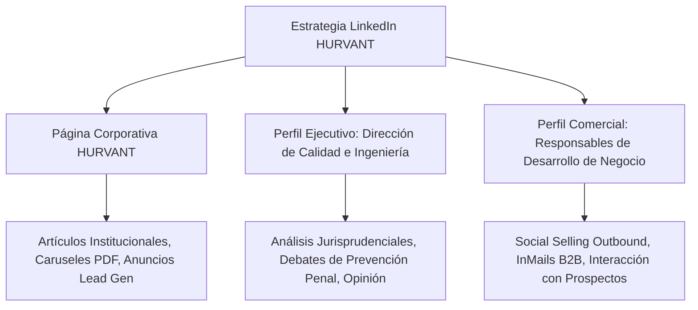

# FASE 4 — ENTREGABLE 4.3: ESTRATEGIA LINKEDIN B2B & SOCIAL SELLING
## HURVANT Certification & Technical Validation

**Fecha de emisión:** Julio 2026  
**Autor:** Director de Marketing Digital & LinkedIn B2B Specialist  
**Proyecto:** Lanzamiento Nacional Hurvant — Fase 4: Estrategia Digital  
**Objetivo:** Canal principal de captación B2B de Directores HSE, COO y C-Levels en España  

---

## 1. OBJETIVOS ESTRATÉGICOS DE LINKEDIN

1. **Lead Generation Directa B2B:** Generar 30+ solicitudes cualificadas (SQL) de Programas Piloto al mes a través de contenido orgánico y prospección Outbound.
2. **Posicionamiento de Autoridad Técnica:** Establecer a HURVANT como la voz de referencia en España sobre la brecha entre la formación teórica y la evaluación práctica real.
3. **Construcción de Comunidad C-Level:** Alcanzar 5.000 seguidores altamente cualificados en la página de empresa (Directores de Prevención, Jefes de Planta, Directores de Compras y Abogados Laboralistas) en los primeros 6 meses.

---

## 2. OPTIMIZACIÓN DE LA PÁGINA CORPORATIVA (COMPANY PAGE)

- **Nombre Oficial:** `HURVANT Certification & Technical Validation`
- **Tagline Oficial (Buscador):** `Evaluamos Competencias, No Asistencias. Organismo Técnico de Certificación (ISO 17024) y Adecuación de Maquinaria (RD 1215/97).`
- **Botón de Acción Principal (CTA):** `Visitar sitio web` (URL con UTM tracking: `https://www.hurvant.com/contacto?utm_source=linkedin&utm_medium=company_page`)
- **Sección Acerca de (About Us):**
  > HURVANT es el Organismo Técnico Independiente de Tercera Parte que transforma la validación operativa industrial en España. Evaluamos observacionalmente la capacidad real de las personas en su puesto de trabajo (ISO 17024), auditamos la adecuación de maquinaria (RD 1215/1997) y ejecutamos Ensayos No Destructivos NDT (ISO 9712). Aportamos evidencias inalterables firmadas criptográficamente con código QR para garantizar la Diligencia Debida corporativa.

---

## 3. ESTRATEGIA DE PERSONAL BRANDING EJECUTIVO

Para maximizar el alcance orgánico en LinkedIn (donde los perfiles personales logran hasta 5x más alcance que las páginas de empresa), activaremos perfiles ejecutivos clave:

---

## 4. PILARES DE CONTENIDO DE LINKEDIN

### Pilar A: Jurisprudencia y Compliance Penal (40% del Contenido)
- Análisis de sentencias reales del Tribunal Supremo sobre recargo de prestaciones tras accidentes laborales.
- Explicación de la responsabilidad legal del Director de Planta al alquilar maquinaria sin comprobación técnica in-situ.

### Pilar B: Casos de Campo y Ensayos NDT (30% del Contenido)
- Caruseles PDF con fotografías de inspecciones por ultrasonidos en grúas y placas metálicas QR fijadas en máquinas.
- Vídeos cortos (15-30 seg) de evaluadores técnicos observando maniobras de carretilleros en centros logísticos.

### Pilar C: Educación y Metodología (20% del Contenido)
- Infografías comparativas: *"Formación Tradicional en Aula vs Evaluación Operativa ISO 17024 en Campo"*.
- Artículos sobre el impacto de la fatiga en operarios de turnos rotativos.

### Pilar D: Cultura de Empresa y Transparencia (10% del Contenido)
- Avisos de Imparcialidad, entrevistas con los miembros del Comité de Imparcialidad externo.

---

## 5. SECUENCIAS DE OUTREACH & MENSAJES INMAIL B2B (SOCIAL SELLING)

### Mensaje InMail 1: Para Directores de Prevención (HSE / PRL)

> **Asunto:** `Diligencia debida y evidencias prácticas ante Inspección de Trabajo en [Empresa_Cliente]`
>  
> Hola [Nombre],  
>  
> He estado siguiendo la trayectoria de [Empresa_Cliente] en el sector logístico/industrial. Como responsable de prevención, sabes que el 90% de las sanciones tras un accidente grave ocurren aunque el operario tuviera el título teórico en regla.  
>  
> En **HURVANT** ayudamos a directores de HSE a resolver esta brecha: evaluamos de manera observacional la competencia práctica real de tu personal in-situ y emitimos actas con huella digital SHA-256 y código QR de verificación instantánea.  
>  
> Nos gustaría ofrecerte la implantación de un **Programa Piloto de 14 Días** (para 10-20 operarios en un turno acotado) para entregarte una Matriz de Riesgo cuantitativa de tu planta sin ningún tipo de compromiso.  
>  
> ¿Te parecería bien que coordinemos una breve llamada de 10 minutos esta semana?  
>  
> Un saludo,  
> **[Nombre_Ejecutivo]**  
> *HURVANT Certification | www.hurvant.com*

---

## 6. CALENDARIO SEMANAL TIPO EN LINKEDIN

| Día | Formato de Publicación | Temática del Contenido |
| :--- | :--- | :--- |
| **Lunes** | Carusel PDF (10 diapositivas) | *Checklist de Inspección de Maquinaria RD 1215/97* |
| **Martes** | Texto largo + Imagen de campo | *Caso de Estudio: Reducción del 65% de daños en estanterías* |
| **Miércoles** | Encuesta B2B interactiva | *¿Cada cuánto tiempo evalúas la habilidad práctica de tus carretilleros?* |
| **Jueves** | Vídeo corto HD (30s) | *Demostración de ensayo NDT por ultrasonidos en grúa torre* |
| **Viernes** | Artículo de Autoridad / Noticia | *La responsabilidad penal del Consejo de Administración en PRL* |

---
