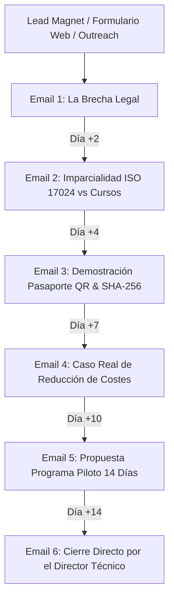

# FASE 4 — ENTREGABLE 4.10: ESTRATEGIA DE EMAIL MARKETING & SECUENCIA C-LEVEL (6 EMAILS)
## HURVANT Certification & Technical Validation

**Fecha de emisión:** Julio 2026  
**Autor:** Especialista en Email Copywriting B2B & Lead Nurturing  
**Proyecto:** Lanzamiento Nacional Hurvant — Fase 4: Estrategia Digital  
**Objetivo:** Conversión de Leads B2B (Directores HSE, COO, CEOs y Directores de Compras) en reservas del Programa Piloto  

---

## 1. ESTRUCTURA DE LA FUNNEL DE EMAIL MARKETING

La secuencia automatizada consta de 6 emails estructurados bajo una lógica de persuasión B2B progresiva (Concienciación del Riesgo Legal → Presentación de la Evidencia Técnica → Demostración Tecnológica → Caso de Estudio → Oferta Piloto sin Riesgo → Cierre Directo).

---

## 2. TEXTOS COMPLETOS DE LA SECUENCIA DE 6 EMAILS B2B

### EMAIL 1 (Día 0): El fallo invisible en tu carpeta de Prevención
- **Asunto:** `[Nombre], el 90% de las empresas sancionadas tenían el certificado en regla`
- **Preheader:** `Por qué la formación teórica en aula no te protege ante un accidente grave.`
- **Cuerpo:**
  > Hola [Nombre],  
  >  
  > Cuando ocurre un accidente grave en una planta industrial o almacén, lo primero que pide el Inspector de Trabajo no es la factura del curso. Pide la **evidencia de la competencia observada en el puesto**.  
  >  
  > El problema es que el 90% de las empresas guardan diplomas teóricos en aula que demuestran la *asistencia*, pero no la *capacidad operativa real* bajo el estrés del turno de trabajo.  
  >  
  > En **HURVANT** hemos nacido para resolver esta brecha: evaluamos de forma observacional in-situ a tu personal (ISO 17024) e inspeccionamos tu maquinaria (RD 1215/97) sin detener tu producción.  
  >  
  > En los próximos días te mostraré cómo estamos blindando legalmente a directores de planta en toda España.  
  >  
  > Un cordial saludo,  
  > **El Equipo de HURVANT Certification**  
  > *www.hurvant.com*

---

### EMAIL 2 (Día 2): Por qué un centro de formación no debe evaluar
- **Asunto:** `Imparcialidad de tercera parte: La diferencia entre evaluar y vender cursos`
- **Preheader:** `El principio de independencia que exige la norma UNE-EN ISO/IEC 17024.`
- **Cuerpo:**
  > Hola [Nombre],  
  >  
  > ¿Confiarías en una ITV si la misma empresa te vendiera el coche y las piezas de recambio?  
  >  
  > En la seguridad industrial ocurre exactamente lo mismo. Un centro que vende horas de formación tiene un conflicto de interés inherente al evaluar a sus propios alumnos.  
  >  
  > En **HURVANT** operamos bajo el estricto principio de **Tercera Parte Independiente**:  
  > ❌ NO vendemos cursos de formación.  
  > ❌ NO vendemos ni reparamos maquinaria.  
  > ✅ Evaluamos con objetividad científica la habilidad práctica real del operario y la adecuación técnica de los equipos.  
  >  
  > Esta imparcialidad es la que otorga valor probatorio inalterable a nuestros dictámenes ante cualquier juzgado.  
  >  
  > [Descubre nuestro Manifiesto de Imparcialidad aquí →]  
  >  
  > Un saludo,  
  > **HURVANT Certification**

---

### EMAIL 3 (Día 4): Evidencia inalterable en el bolsillo del operario
- **Asunto:** `[Demo] Cómo funciona el Pasaporte Técnico QR y la firma SHA-256`
- **Preheader:** `Verificación instantánea en campo desde cualquier smartphone.`
- **Cuerpo:**
  > Hola [Nombre],  
  >  
  > Imagina que un inspector de trabajo entra a tu planta a las 11:00 AM y solicita verificar la aptitud del operario de la carretilla #4.  
  >  
  > Con el sistema tradicional, tendrías que buscar en carpetas físicas o PDFs traspapelados.  
  >  
  > Con **HURVANT**:  
  > 1. El operario muestra el **Pasaporte QR Móvil** en su teléfono o tarjeta.  
  > 2. El inspector escanea el QR y accede al expediente firmado con **huella criptográfica SHA-256**.  
  > 3. En 5 segundos queda demostrada la Diligencia Debida corporativa.  
  >  
  > Además, tu departamento de RRHH y PRL cuenta con una **Skill Matrix en tiempo real** en nuestro Portal SaaS.  
  >  
  > [Ver demostración interactiva del Pasaporte QR →]  
  >  
  > Un saludo,  
  > **HURVANT Technical Team**

---

### EMAIL 4 (Día 7): Caso Real: Reducción del 65% de daños en estanterías
- **Asunto:** `Caso de Estudio: De 18.000€ en averías a cero accidentes en 6 meses`
- **Preheader:** `Cómo un centro logístico en Barcelona transformó su operativa con HURVANT.`
- **Cuerpo:**
  > Hola [Nombre],  
  >  
  > El impacto de la falta de evaluación práctica no solo es legal; es directamente económico.  
  >  
  > Un centro logístico con 45 carretilleros sufría pérdidas constantes de más de 18.000€ anuales por roces en estanterías y averías en mástiles de maquinaria alquilada. Todos los operarios tenían su "carnet de carretillero".  
  >  
  > Tras la intervención de **HURVANT**:  
  > - Auditamos in-situ las competencias observadas de los 45 operarios en su turno habitual.  
  > - Detectamos a 7 operarios con hábitos de riesgo no identificados en el aula.  
  > - Emplazamos placas QR metálicas en las 12 carretillas.  
  >  
  > **Resultado a los 6 meses:** Reducción del 65% en averías de maquinaria y cero sanciones preventivas.  
  >  
  > [Leer el Caso de Estudio completo aquí →]  
  >  
  > Un saludo,  
  > **HURVANT Certification**

---

### EMAIL 5 (Día 10): Propuesta del Programa Piloto de 14 Días
- **Asunto:** `Prueba la metodología HURVANT en 1 turno de tu planta (Sin compromiso)`
- **Preheader:** `Programa Piloto de 14 días para 10-20 operarios.`
- **Cuerpo:**
  > Hola [Nombre],  
  >  
  > Queremos facilitarte la comprobación directa del valor que HURVANT aporta a tu empresa sin asumir ningún riesgo operativo ni compromiso contractual de permanencia.  
  >  
  > Te proponemos nuestro **Programa Piloto de 14 Días**:  
  >  
  > 🔹 **Alcance:** Evaluamos a 10-20 operarios en 1 turno o área acotada de tu planta.  
  > 🔹 **Ejecución:** Cero paradas de producción. El evaluador trabaja de forma invisible observando la operativa real.  
  > 🔹 **Entregable:** En 14 días te entregamos el Informe Ejecutivo de Riesgo y el acceso al Portal SaaS Piloto.  
  >  
  > Si los resultados no te convencen, no tendrás ningún compromiso posterior.  
  >  
  > [Solicitar reunión para activar el Piloto de 14 Días →]  
  >  
  > Un saludo,  
  > **Dirección Comercial HURVANT**

---

### EMAIL 6 (Día 14): Cierre Directo del Director Técnico
- **Asunto:** `[Nombre], ¿agendamos 10 minutos esta semana?`
- **Preheader:** `Última llamada para reservar plaza en el Programa Piloto.`
- **Cuerpo:**
  > Hola [Nombre],  
  >  
  > Soy Antonio Contreras, Director Técnico en **HURVANT**.  
  >  
  > Sé que tu agenda como responsable de [Empresa/Departamento] está llena de prioridades. Por eso quiero ir al grano:  
  >  
  > Si quieres asegurarte de que tu empresa cuenta con la máxima protección legal ante la Inspección de Trabajo y garantizar que tu personal opera con total seguridad en campo, hablemos 10 minutos esta semana.  
  >  
  > Puedes reservar directamente el día y hora que mejor te convenga en mi agenda personal:  
  >  
  > 👉 [Reservar llamada de 10 min en mi calendario →]  
  >  
  > O si lo prefieres, respóndeme a este correo y coordinamos la sesión.  
  >  
  > Un saludo cordial,  
  > **Antonio Contreras**  
  > *Director Técnico | HURVANT Certification*  
  > 📧 a.contreras@hurvant.com | ☎️ +34 611 888 179

---
