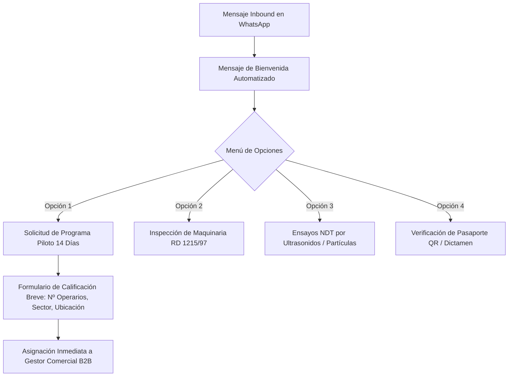

# FASE 4 — ENTREGABLE 4.11: WHATSAPP BUSINESS CORPORATIVO & AUTOMATIZACIONES
## HURVANT Certification & Technical Validation

**Fecha de emisión:** Julio 2026  
**Autor:** Especialista en Conversational Marketing & WhatsApp Cloud API  
**Proyecto:** Lanzamiento Nacional Hurvant — Fase 4: Estrategia Digital  
**Objetivo:** Canal directo de atención inmediata, calificación de leads y soporte de verificación de Pasaporte QR  

---

## 1. CONFIGURACIÓN DEL PERFIL CORPORATIVO DE WHATSAPP BUSINESS

- **Número Oficial:** `+34 611 888 179`
- **Nombre de la Cuenta Homologada (Green Tick):** `HURVANT Certification`
- **Categoría:** Servicio de Inspección Técnica / Certificación
- **Descripción del Perfil:**
  > Organismo Técnico Independiente de Tercera Parte. Evaluación observacional de personas (ISO 17024), adecuación de maquinaria (RD 1215/97) y Ensayos NDT (ISO 9712). Trazabilidad SHA-256.  
  > 🌐 www.hurvant.com | 📧 hello@hurvant.com
- **Horario de Atención:** Lunes a Viernes de 08:00 a 19:00 (Respuesta automatizada 24/7 en fuera de horario).

---

## 2. FLUJOS AUTOMATIZADOS DEL CHATBOT DE BIENVENIDA Y CALIFICACIÓN

---

## 3. PLANTILLAS DE MENSAJES HOMOLOGADAS POR META (HSM - HIGH SAFETY MESSAGES)

### Plantilla 1: Confirmación de Reserva del Programa Piloto
> *"Hola {{1}}, le confirmamos la recepción de su solicitud del Programa Piloto de 14 Días para su planta en {{2}}. Su Gestor Técnico asignado es {{3}}, quien le contactará en breve para coordinar el turno de evaluación. Puede consultar el expediente inicial en: {{4}}"*

### Plantilla 2: Notificación de Dictamen Técnico Emitido
> *"Estimado/a {{1}}, le informamos que el Dictamen Técnico de Inspección de la maquinaria {{2}} (Nº Serie {{3}}) ha sido emitido con éxito y firmado criptográficamente (SHA-256). Puede descargar la documentación y visualizar la placa QR aquí: {{4}}"*

---
