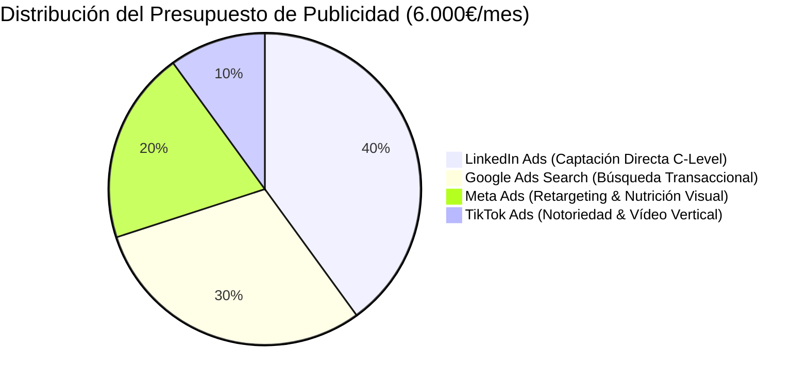

# FASE 5 — ENTREGABLE 5.1: PLAN DE MEDIOS Y REPARTO DE PRESUPUESTO
## HURVANT Certification & Technical Validation

**Fecha de emisión:** Julio 2026  
**Autor:** Director de Growth Marketing & Paid Media Lead  
**Proyecto:** Lanzamiento Nacional Hurvant — Fase 5: Estrategia de Publicidad  
**Objetivo:** Distribución óptima de inversión publicitaria para captación masiva de Leads B2B cualificados  

---

## 1. ESTRATEGIA GLOBAL DE INVERSIÓN (MEDIA PLAN B2B)

Para el lanzamiento oficial de HURVANT en España, se establece un presupuesto recomendado de **6.000€ / mes** en paid media durante los 3 primeros meses de lanzamiento (Fase de Aceleración), distribuidos según la intención de compra del cliente objetivo.



---

## 2. DESGLOSE DEL PRESUPUESTO Y KPIS ESTIMADOS

| Canal Publicitario | Presupuesto Mensual | CPL Estimado (Coste por Lead) | Leads Cualificados / Mes | CTR Objetivo | Objetivo Principal |
| :--- | :--- | :--- | :--- | :--- | :--- |
| **LinkedIn Ads** | 2.400€ (40%) | 60€ - 85€ | 30 - 40 SQLs | > 0,95% | Directores HSE, COO y Compras |
| **Google Ads (Search)** | 1.800€ (30%) | 35€ - 50€ | 36 - 50 SQLs | > 5,50% | Captación de intención explícita de compra |
| **Meta Ads (FB/IG)** | 1.200€ (20%) | 25€ - 35€ | 34 - 48 Leads | > 1,40% | Retargeting web + Notoriedad visual |
| **TikTok Ads** | 600€ (10%) | 20€ - 30€ | 20 - 30 Leads | > 1,10% | Notoriedad amplia & impacto en operarios |
| **TOTAL MENS.** | **6.000€** | **Blended CPL: ~45€** | **120 - 168 SQLs** | **--** | **Conversión a Programas Piloto** |

---

## 3. ESTRUCTURA DE FUNNEL DE CONVERSIÓN (TOFU / MOFU / BOFU)

```
+-----------------------------------------------------------------------------------+
| TOFU (Top of Funnel) - Notoriedad & Descubrimiento                               |
| Meta Ads & TikTok Ads (Vídeos impactantes de NDT y seguridad en carretillas)       |
+-----------------------------------------------------------------------------------+
                                         │
                                         ▼
+-----------------------------------------------------------------------------------+
| MOFU (Middle of Funnel) - Consideración & Evaluación Técnica                      |
| LinkedIn Ads Lead Gen (Descarga de Guía RD 1215/97 y Comparativas ISO 17024)      |
+-----------------------------------------------------------------------------------+
                                         │
                                         ▼
+-----------------------------------------------------------------------------------+
| BOFU (Bottom of Funnel) - Conversión a Programa Piloto (14 Días)                  |
| Google Ads Search (Búsquedas urgentes) + Retargeting Meta/LinkedIn                |
+-----------------------------------------------------------------------------------+
```

---
