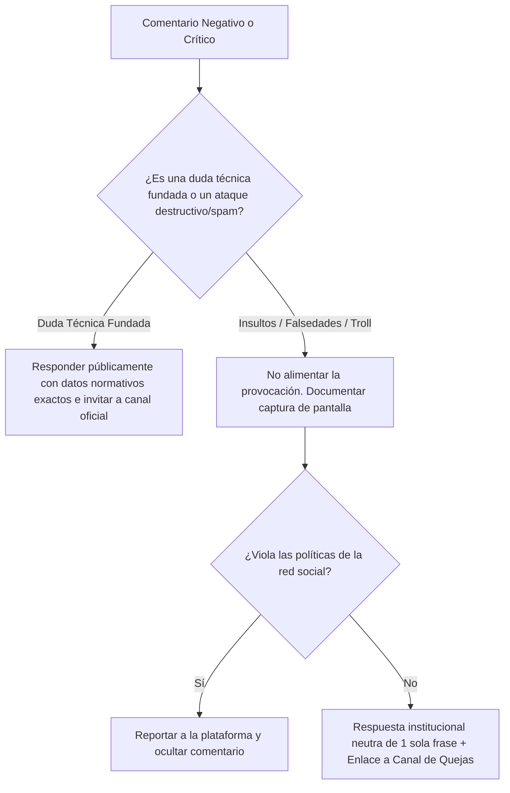

# FASE 6 — ENTREGABLE 6.2: MANUAL DE PROTOCOLO DE COMMUNITY MANAGEMENT Y GESTIÓN DE CRISIS
## HURVANT Certification & Technical Validation

**Fecha de emisión:** Julio 2026  
**Autor:** Community Manager Senior & Director de Reputación Corporativa  
**Proyecto:** Lanzamiento Nacional Hurvant — Fase 6: Redes Sociales  
**Objetivo:** Guía de moderación, tono de respuesta a comentarios y protocolo de gestión de crisis reputacionales  

---

## 1. DIRECTRICES DE TONO Y LENGUAJE

- **Voz Corporativa:** Institucional, rigurosa, sumamente respetuosa, basada en la normativa técnica (ISO/IEC, Real Decreto) y orientada al valor probatorio.
- **Tiempos de Respuesta Objetivo:**
  - Comentarios en publicaciones: < 2 horas en horario laboral.
  - Mensajes directos (DMs / InMail): < 30 minutos.

---

## 2. ARBOLEDA DE RESPUESTAS A PREGUNTAS FRECUENTES (FAQ PROTOCOL)

### Pregunta 1: "¿Ustedes dan el carnet de carretillero o imparten cursos?"
- **Respuesta Oficial:**  
  > *"Hola [Nombre]. En HURVANT operamos como Organismo Técnico Independiente de Tercera Parte conforme a la norma UNE-EN ISO/IEC 17024. Por estricto principio de imparcialidad, **no impartimos cursos de formación ni vendemos carnets teóricos**. Lo que realizamos es la evaluación observacional de competencias en el puesto físico de trabajo y la emisión del Pasaporte Técnico QR inalterable con firmas criptográficas SHA-256. Saludos."*

### Pregunta 2: "¿Cuánto cuesta la inspección de una carretilla o maquinaria?"
- **Respuesta Oficial:**  
  > *"Estimado/a [Nombre], el coste de la inspección técnica según el Real Decreto 1215/1997 depende del volumen del parque de maquinaria y la ubicación del centro productivo. Le invitamos a solicitar una propuesta personalizada o activar nuestro Programa Piloto de 14 Días en www.hurvant.com/contacto o escribiéndonos directamente a hola@hurvant.com."*

---

## 3. PROTOCOLO DE GESTIÓN DE CRISIS Y COMENTARIOS NEGATIVOS (TROLLS / TROLING)

---
