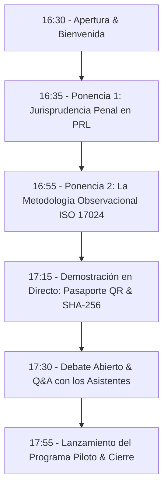

# FASE 7 — ENTREGABLE 7.3: PLAN DE EVENTO INAUGURAL & WEBINAR INSTITUCIONAL
## HURVANT Certification & Technical Validation

**Fecha de emisión:** Julio 2026  
**Autor:** Director de Eventos & Event Marketing Specialist  
**Proyecto:** Lanzamiento Nacional Hurvant — Fase 7: Plan Maestro de Lanzamiento  
**Objetivo:** Evento digital de lanzamiento nacional para convocar a 200+ Directores HSE, COO y Abogados Laboralistas  

---

## 1. FICHA TÉCNICA DEL WEBINAR INAUGURAL

- **Título del Evento:** *Simposio Digital de Compliance Industrial: De la Formación Teórica a la Evidencia Observada en Campo*
- **Fecha y Hora:** Jueves 24 de Septiembre de 2026 — 16:30 a 18:00 CEST.
- **Plataforma:** Zoom Events + Emisión Simultánea en Directo en LinkedIn Live y YouTube Live.
- **Formato:** Mesa redonda técnica (45 min) + Preguntas de los asistentes (30 min) + Presentación del Programa Piloto (15 min).

---

## 2. PANELES Y ESTRUCTURA DEL PROGRAMA

---

## 3. COMPONENTES DEL PACK DE REGALO A ASISTENTES (LEAD MAGNET INAUGURAL)

Todos los directores inscritos que asistan al webinar recibirán en su correo:
1. **Guía Ejecutiva en PDF (30 Páginas):** *"Manual de Adecuación RD 1215/97 y Diligencia Debida ante la Inspección de Trabajo"*.
2. **Acceso Prioritario de 30 Días al Portal SaaS de Hurvant.**
3. **Reserva Directa sin Coste de la Auditoría Inicial del Programa Piloto.**

---
