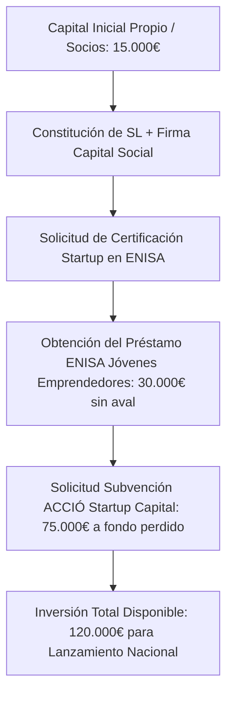

# GUÍA ESTRATÉGICA DE FINANCIACIÓN PÚBLICA, SUBVENCIONES Y LEY DE STARTUPS
## HURVANT Certification & Technical Validation

**Fecha de emisión:** Julio 2026  
**Autor:** Director Financiero (CFO) & Especialista en Financiación Pública  
**Proyecto:** Estrategia de Inversión Inicial y Ayudas Estatales/Autonómicas para Hurvant  
**Objetivo:** Obtención de capital público sin avales personales, subvenciones a fondo perdido y beneficios fiscales para emprendedores extranjeros en España  

---

## 1. MARCO LEGAL Y BENEFICIOS DE LA LEY DE STARTUPS (LEY 28/2022) PARA EM PRENDEDORES EXTRANJEROS

Hurvant encaja perfectamente en la definición de **Empresa Emergente (Startup Tecnológica)** por combinar desarrollo de software SaaS (Portal de Trazabilidad Criptográfica SHA-256) con inspección técnica de tercera parte.

### 1.1. Certificación Oficial por ENISA
- HURVANT puede solicitar la **Certificación de Empresa Emergente** expedida de forma gratuita por ENISA en un plazo máximo de 3 meses.
- **Beneficios Fiscales Directos:**
  - **Impuesto de Sociedades Reducido al 15%** (en lugar del tipo general del 25%) durante el primer ejercicio con base imponible positiva y los 3 siguientes (total 4 años).
  - **Aplazamiento de Deudas Tributarias:** Aplazamiento automático del pago del Impuesto sobre Sociedades durante los 2 primeros ejercicios positivos sin necesidad de aportar garantías o avales bancarios.
  - **Eliminación de los pagos a cuenta** del Impuesto sobre Sociedades durante los 2 primeros años.

### 1.2. Autorización de Residencia para Emprendedores Extranjeros (Ley 14/2013)
- **Visado de Emprendedor / Residencia de Startup:** Permite al emprendedor extranjero y a su familia obtener la residencia legal en España por **3 años** (renovable por 2 años más).
- **Trámite de ENISA:** ENISA evalúa favorablemente el Plan de Empresa de Hurvant al ser un proyecto de alto valor añadido con creación de empleo local en Cataluña y desarrollo tecnológico propio.

---

## 2. LÍNEAS DE CRÉDITO PÚBLICAS SIN AVALES PERSONALES (PRÉSTAMOS PARTICIPATIVOS)

### 2.1. ENISA — Línea Jóvenes Emprendedores / ENISA Startups
Es la principal fuente de financiación pública blanda en España para la puesta en marcha de empresas innovadoras.
- **Cuantía del Préstamo:** Desde **25.000 € hasta 300.000 €** (según necesidades de tesorería y fondos propios).
- **Garantías Exigidas:** **NINGUNA.** No requiere avales personales del emprendedor ni hipotecas reales. La única garantía es la viabilidad del propio proyecto HURVANT.
- **Tipos de Interés:** Tipo variable bonificado (Euríbor + diferencial del 3,75% al 8% según rentabilidad).
- **Plazo de Amortización:** Hasta 7 años, con hasta **3 años de carencia** inicial.
- **Requisito Clave de Fondos Propios:**
  - En la línea *Jóvenes Emprendedores* (<40 años), los socios deben aportar en fondos propios al menos el **50% de la cuantía solicitada** a ENISA (ejemplo: para pedir 30.000 € a ENISA, los socios deben aportar 15.000 € al capital de Hurvant).
  - En la línea *Startups General*, la relación de Fondos Propios es de **1:1** (1 € de fondos propios por cada 1 € de préstamo ENISA).

---

### 2.2. ICO — Línea ICO Empresas y Emprendedores (vía Banca Comercial)
- **Entidades Colaboradoras:** Banco Santander, BBVA, CaixaBank, Sabadell.
- **Función:** Financiación garantizada parcialmente por el Instituto de Crédito Oficial para compra de activos fijos (equipos NDT, tablets, vehículos) y liquidez.
- **Condiciones:** Tipos de interés bonificados y plazos de devolución de hasta 20 años (con carencia de hasta 3 años).

---

### 2.3. ICF (Institut Català de Finances) — Préstamos ICF Emprèn
- **Organismo:** Entidad financiera pública de la Generalitat de Catalunya.
- **Cuantía:** Préstamos participativos desde **20.000 € hasta 200.000 €**.
- **Requisito:** Pymes o Startups con sede operativa en Cataluña.

---

## 3. SUBVENCIONES Y AYUDAS A FONDO PERDIDO (GRANTS)

### 3.1. ACCIÓ — Programa Startup Capital (Generalitat de Catalunya)
- **Importe:** Hasta **100.000 € A FONDO PERDIDO** (subvención no reembolsable).
- **Dirigido a:** Startups tecnológicas emergentes de entre 3 meses y 3 años de vida con sede en Cataluña.
- **Uso de los Fondos:** Financiación de salarios del equipo, desarrollo de la plataforma SaaS, compra de equipamiento NDT y estrategia de marketing.

### 3.2. ACCIÓ — Cupons d'Innovació i Tecnologia
- **Importe:** Subvenciones de **6.000 € a 20.000 €** para la contratación de proveedores tecnológicos y auditorías de ciberseguridad/RGPD.

### 3.3. CDTI — Programa NEOTEC (Fase de Crecimiento Tecnológico)
- **Importe:** De **250.000 € a 325.000 € a fondo perdido** para empresas con un fuerte componente de I+D propia (Portal SaaS e Inteligencia de Datos).

---

## 4. AYUDAS AL TRABAJO AUTÓNOMO Y CAPITALIZACIÓN

1. **Cuota Reducida de Autónomo (Tarifa Plana):**  
   - En Cataluña, la cuota fija es de **80 €/mes** durante el primer año.  
   - Además, el Departament d'Empresa i Treball de la Generalitat bonifica el 100% de la cuota para jóvenes y nuevos emprendedores.
2. **Pago Único del Paro (Capitalización del Desempleo):**  
   - Si el emprendedor tuviera prestación por desempleo acumulada en España o UE, puede solicitar el 100% del importe en un único pago para financiar el capital social inicial de HURVANT y la compra del equipo físico NDT.

---

## 5. HOJA DE RUTA RECOMENDADA PARA LA INVERSIÓN INICIAL DE HURVANT

### Plan Financiero de Despliegue de Inversión Inicial (120.000 € Totales)
- **Equipamiento Físico NDT & Hardware de Campo:** 4.400 €
- **Desarrollo del Portal SaaS & Infraestructura Cloud:** 12.000 €
- **Campaña de Lanzamiento & Publicidad Paid Media (Fase 5):** 18.000 € (3 meses a 6.000€/mes)
- **Personal Técnico & Gastos Operativos:** 60.000 €
- **Fondo de Reserva de Tesorería:** 25.600 €

---
