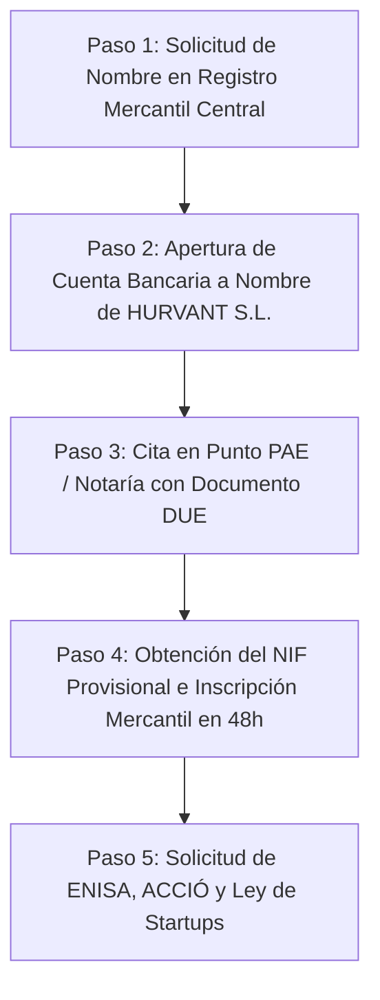

# GUÍA PASO A PASO: CONSTITUCIÓN DE EMPRESA (S.L.), FINANCIACIÓN, ENLACES OFICIALES Y PLAZOS
## HURVANT Certification & Technical Validation

**Fecha de emisión:** Julio 2026  
**Autor:** Dirección Jurídica y Financiera  
**Proyecto:** Constitución Exprés y Estrategia de Capitalización Inicial  
**Objetivo:** Guía práctica para dar de alta HURVANT S.L. desde cero aprovechando ayudas públicas, enlaces web y plazos legales  

---

## 1. ¿PUEDO USAR ESTOS FONDOS PARA DAR DE ALTA LA EMPRESA DESDE CERO?

### Respuesta Clara y Directa:
1. **Paso Previo Obligatorio (Constitución Legal):** Para que ENISA te conceda el préstamo o ACCIÓ te apruebe los 100.000 €, **la empresa (HURVANT S.L.) debe estar dada de alta e inscrita en el Registro Mercantil**. Los organismos públicos no transfieren dinero a proyectos sin personalidad jurídica constituida.
2. **Financiación Retroactiva de Gastos de Alta (Reembolso 100%):** Todos los gastos iniciales de constitución (gastaría, notaría, registro mercantil, tasación de marcas, asesoría jurídica inicial) **SÍ SON GASTOS ELEGIBLES Y REEMBOLSABLES** tanto por ENISA como por la subvención de ACCIÓ. Es decir, una vez concedidos los fondos, te devuelven el dinero invertido en darla de alta.
3. **Mecanismo de Capital Social Mínimo (3.000 € o 1 €):** Desde la aprobación de la Ley Crea y Crece (Ley 18/2022), puedes constituir una S.L. con **1 € de capital social mínimo** (aunque se recomienda aportar entre 3.000 € y 15.000 € para mejorar el ratio de fondos propios ante ENISA).
4. **Pago Único del Paro (Capitalización del Desempleo):** Si dispones de prestación por desempleo acumulada en España, **SÍ PUEDES USAR EL 100% DE ESE DINERO** para constituir la empresa, pagar el capital social inicial y abonar las cuotas de autónomos.

---

## 2. RUTA DE ALTA EXPRÉS (SISTEMA CIRCE / VÍA PAE EN 48 HORAS)

Para constituir la S.L. al menor coste posible (~250 € - 300 € totales de notario y registro) y en solo 48 horas, se utiliza el sistema oficial del Gobierno de España **CIRCE** a través de un **Punto de Atención al Emprendedor (PAE)**.

---

## 3. ENLACES OFICIALES, PLAZOS Y DÓNDE SOLICITAR CADA RECURSO

### PASO 1: Constitución Exprés de la Empresa (CIRCE / PAE)
- **Dónde se solicita:** En la plataforma **CIRCE** o en cualquier punto PAE oficial de Cataluña (Cámaras de Comercio, Barcelona Activa o gestorías acreditadas).
- **Enlace Oficial:** [Portal CIRCE - Gobierno de España](https://circe.subdirecciongeneralsipyme.gob.es/)
- **Plazo de Gestión:** **48 a 72 horas**.
- **Coste:** ~250 € (Honorarios de notario y registro reducidos por arancel oficial).

---

### PASO 2: Solicitud de Préstamo Participativo ENISA (Sin Avales)
- **Dónde se solicita:** Exclusivamente online a través del Portal **Prometeo** de ENISA.
- **Enlace Oficial:** [Portal Prometeo ENISA](https://prometeo.enisa.es/)
- **Plazo de Convocatoria:** **Abierto todo el año** (Convocatoria continua 24/7).
- **Tiempo de Resolución:** **60 a 90 días** desde que la documentación se presenta completa.

---

### PASO 3: Subvención a Fondo Perdido ACCIÓ Startup Capital (Hasta 100.000 €)
- **Dónde se solicita:** En el portal de trámites de la **Generalitat de Catalunya (ACCIÓ)**.
- **Enlace Oficial:** [ACCIÓ - Startup Capital Generalitat de Catalunya](https://www.accio.gencat.cat/es/serveis/financament/financament-actius-immateriales/startup-capital/)
- **Plazo de Convocatoria:** Convocatoria anual (habitualmente se abre entre mayo y septiembre).
- **Tiempo de Resolución:** **2 a 3 meses**.

---

### PASO 4: Residencia para Emprendedores Extranjeros (Ley 14/2013)
- **Dónde se solicita:** En la **Unidad de Grandes Empresas y Colectivos Estratégicos (UGE-CE)** del Ministerio de Inclusión, Seguridad Social y Migraciones.
- **Enlace Oficial:** [Portal UGE-CE Trámites de Residencia](https://pge.azurewebsites.net/) / [Sección de Extranjería](https://extranjeros.inclusion.gob.es/)
- **Plazo de Convocatoria:** Abierto todo el año.
- **Tiempo de Resolución Legal:** **20 días hábiles** (cuenta con Silencio Administrativo Positivo: si en 20 días no responden, la residencia queda aprobada automáticamente).

---

### PASO 5: Certificación de Empresa Emergente (Ley de Startups - Tipo 15%)
- **Dónde se solicita:** En la plataforma habilitada por ENISA para certificar Startups.
- **Enlace Oficial:** [Certificación de Startups en ENISA](https://www.enisa.es/es/certificacion-startup)
- **Plazo de Convocatoria:** Abierto todo el año.
- **Tiempo de Resolución:** **3 meses máximo**.

---

### PASO 6: Bonificación de Cuota de Autónomo (Tarifa Plana 80 € / 0 €)
- **Dónde se solicita:** En la Tesorería General de la Seguridad Social (**Import@ss**) y en la web del Departament d'Empresa i Treball de Cataluña.
- **Enlace Oficial:** [Portal Import@ss Seguridad Social](https://portal.seg-social.gob.es/)
- **Plazo:** Durante los 30 días posteriores al alta de la empresa.

---
