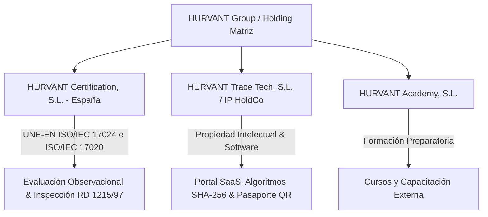
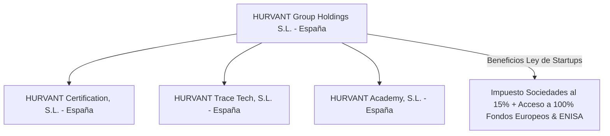

# ANÁLISIS ESTRATÉGICO: ESTRUCTURA HOLDING (ANDORRA VS ESPAÑA), FONDOS EUROPEOS E IMPARCIALIDAD ISO
## HURVANT Certification, HURVANT Trace & HURVANT Academy

**Fecha de emisión:** Julio 2026  
**Autor:** Dirección Financiera (CFO) & Especialista en Derecho Fiscal e Internacional  
**Proyecto:** Evaluación de la Estructura de Holding Corporativo para HURVANT  
**Objetivo:** Análisis de ventajas, desventajas, impacto en Subvenciones/Fondos Europeos (NextGenEU/CDTI/ENISA) y blindaje de la Imparcialidad ISO 17024 / 17020  

---

## 1. LA ARQUITECTURA DE HOLDING PROUESTA (SEPARACIÓN DE UNIDADES DE NEGOCIO)

La creación de una estructura holding con filiales independientes es una excelente práctica de arquitectura corporativa para **HURVANT**, ya que resuelve el requisito legal de **Imparcialidad de Tercera Parte**:



### Por qué esta separación es brillante para las Normas ISO:
- **Separación de Riesgo e Imparcialidad:** La norma ISO/IEC 17024 e ISO/IEC 17020 prohíben estrictamente que la misma entidad jurídica que certifica o inspecciona sea la que imparte la formación o repare la maquinaria. Al separar `Hurvant Certification` de `Hurvant Academy`, se demuestra ante ENAC (Entidad Nacional de Acreditación) la independencia jurídica y operativa.

---

## 2. MATRIZ EN ANDORRA VS MATRIZ EN ESPAÑA: IMPACTO EN FONDOS EUROPEOS Y SUBVENCIONES

### ⚠️ El Factor Clave: ANDORRA NO ES MIEMBRO DE LA UNIÓN EUROPEA
Andorra es un microestado soberano con acuerdos aduaneros con la UE, pero **NO forma parte de la Unión Europea**. Esto tiene consecuencias trascendentales en la captación de ayudas públicas:

```
+-----------------------------------------------------------------------------------+
|               MATRIZ DE COMPATIBILIDAD CON AYUDAS Y SUBVENCIONES                  |
+-----------------------------------------------------------------------------------+
| Instrumento de Financiación      | Matriz en ESPAÑA (UE)   | Matriz en ANDORRA (No UE) |
+----------------------------------+-------------------------+--------------------------+
| Fondos Europeos NextGenEU        | 🟢 100% Elegible        | 🔴 Incompatible          |
| CDTI NEOTEC (Hasta 325.000€)     | 🟢 100% Elegible        | 🔴 Incompatible          |
| ACCIÓ Startup Capital (100.000€) | 🟢 100% Elegible        | 🔴 Incompatible          |
| Préstamo ENISA (Sin Avales)      | 🟢 100% Elegible        | 🔴 Incompatible en Matriz|
| EIC Accelerator (Unión Europea)  | 🟢 100% Elegible        | 🔴 Incompatible          |
| Tributación Imp. Sociedades      | 15% (Ley Startups) / 25%| 10% Máximo               |
+-----------------------------------------------------------------------------------+
```

---

## 3. VENTAJAS Y DESVENTAJAS DE CONSTITUIR LA HOLDING EN ANDORRA

### 🟢 VENTAJAS DE LA HOLDING EN ANDORRA

1. **Baja Tributación Nominal:** Impuesto sobre Sociedades del **10% máximo** (con exenciones para dividendos filiales en determinadas condiciones) e IRPF máximo del 10%.
2. **Protección de Marcas y Propiedad Intelectual (IP):** Si `Hurvant Trace Tech` (matriz andorrana) posee las patentes, marcas y el software SaaS, puede licenciar el software a la filial española a cambio de un canon de royaltis.
3. **Internacionalización Fuera de la UE:** Facilidad de estructuración si el objetivo es expandirse a Latinoamérica, Suiza o Reino Unido.

---

### 🔴 DESVENTAJAS Y RIESGOS CRÍTICOS DE LA HOLDING EN ANDORRA

#### 1. Pérdida Total de Fondos Europeos Directos para la Matriz
- Los programas de la UE (Horizon Europe, EIC Accelerator, NextGenerationEU) **exigen obligatoriamente que la entidad matriz o solicitante principal esté constituida en un Estado Miembro de la UE**.
- Andorra no contribuye al presupuesto comunitario de la UE, por lo que las empresas andorranas no pueden ser beneficiarias directas de subvenciones europeas a fondo perdido.

#### 2. Bloqueo de ENISA y Financiación Blanda Estatal
- ENISA financia exclusivamente PYMEs constituidas y radicadas en España. Si la matriz está en Andorra, solo podrías pedir ENISA a través de la filial española (`Hurvant Certification S.L.`).
- **Problema Legal ENISA:** Los contratos de préstamo de ENISA prohíben expresamente que los fondos prestados sean desviados mediante cánones inflados de software o dividendos hacia una matriz extranjera (lo consideran desvío de capital público).

#### 3. Escrutinio de la Agencia Tributaria Española (AEAT) y "Sustancia Económica"
- Si creas la holding en Andorra pero los fundadores, inspectores, ingenieros y reuniones de decisión ocurren en España, Hacienda aplicará el principio de **Lugar de Dirección Efectiva** (Art. 9.1 LIS) y considerará a la matriz andorrana como **residente fiscal en España**, obligándola a tributar al 25% y aplicando sanciones por Transparencia Fiscal Internacional.
- Para evitar esto, la holding en Andorra requiere **sustancia real**: oficina física en Andorra, empleados locales contratados en Andorra y administradores residentes reales en Andorra.

---

## 4. LA ALTERNATIVA MÁS EFICIENTE: HOLDING ESPAÑOLA CON LEY DE STARTUPS (15% IS)

Para captar Fondos Europeos y subvenciones de forma masiva mientras se optimiza la carga fiscal, la estructura recomendada por los expertos para los primeros 3 a 5 años es:



### Por qué la Holding en España es la Mejor Estrategia Inicial:
1. **Acceso al 100% de Fondos Europeos y Estatales:** Elegibilidad directa para CDTI NEOTEC (325.000€), ACCIÓ (100.000€) y ENISA (300.000€).
2. **Impuesto de Sociedades Reducido al 15%:** Bajo la Ley de Startups (Ley 28/2022), las filiales tecnológicas tributan solo al 15% durante 4 ejercicios.
3. **Exención de Dividendos (Art. 21 LIS):** Los dividendos que repartan las filiales españolas a la Holding española están exentos al 95% de impuestos.
4. **Posibilidad de Redomiciliación Futura:** Cuando Hurvant facture más de 2M€ a nivel internacional y no dependa de subvenciones europeas, se puede realizar un canje de valores o migración de la Holding a Andorra o Países Bajos de forma limpia.

---
