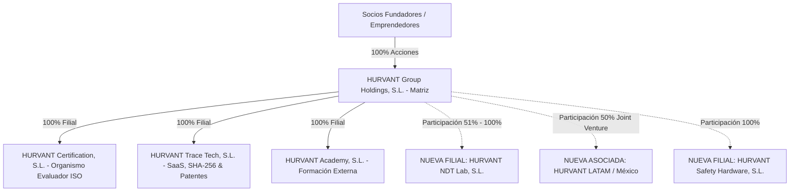

# ARQUITECTURA FISCAL Y CORPORATIVA: HURVANT GROUP HOLDINGS, S.L.
## Estructura de Grupo, Consolidación Fiscal e Incorporación de Empresas Asociadas

**Fecha de emisión:** Julio 2026  
**Autor:** Director Financiero (CFO) & Asesor Fiscal Corporativo  
**Proyecto:** Diseño del Ecosistema Societario y Fiscal de HURVANT Group Holdings, S.L.  
**Objetivo:** Guía completa sobre blindaje patrimonial, consolidación fiscal, exención de dividendos e incorporación progresiva de nuevas filiales/asociadas  

---

## 1. LA ARQUITECTURA SOCIETARIA DE HURVANT GROUP HOLDINGS, S.L.

Una **Sociedad Holding (Sociedad Matriz)** es una mercantil cuyo objeto social principal es la tenencia y gestión de participaciones en otras empresas (filiales y asociadas).



---

## 2. VENTAJAS Y ESTRATEGIA FISCAL DEL HOLDING EN ESPAÑA

### 2.1. Exención del 95% en la Repartición de Dividendos (Art. 21 LIS)
- Cuando una filial (ejemplo: *Hurvant Certification S.L.*) genera beneficios y reparte dividendos a la Holding matriz (`HURVANT Group Holdings S.L.`), **el 95% de esos dividendos está exento de tributar** en el Impuesto sobre Sociedades.
- **Tributación Real de los Dividendos:** Solo se paga el 25% sobre el 5% no exento, lo que equivale a un **impuesto real efectivo de solo el 1,25%**.
- **Ventaja de Reinversión:** El 98,75% del beneficio limpio acumulado en la Holding se puede utilizar para financiar el lanzamiento de **nuevas empresas asociadas**, comprar equipamiento o invertir en bienes inmuebles sin pasar por el IRPF personal del socio (que tributaría al 26%-28%).

---

### 2.2. Régimen de Consolidación Fiscal (Impuesto sobre Sociedades)
Si la Holding posee más del **75% de participación** en las filiales, puede acogerse al **Régimen Especial de Consolidación Fiscal**:
- **Compensación de Pérdidas y Ganancias del Grupo:** Si *Hurvant Trace Tech S.L.* pierde 30.000 € este año por invertir en I+D de software y *Hurvant Certification S.L.* gana 50.000 €, **el grupo solo tributa por el beneficio neto real de 20.000 €**.
- Se presenta un único Impuesto sobre Sociedades consolidado para todo el grupo.

---

### 2.3. Régimen Especial del Grupo de Entidades en IVA (REGE)
- Permite liquidar el IVA de forma agregada entre todas las filiales.
- El IVA a devolver de una empresa en desarrollo (compra de servidores, software) se compensa con el IVA a pagar de las empresas en explotación comercial.

---

### 2.4. Blindaje Patrimonial y Empresa Familiar (Impuesto sobre el Patrimonio)
- **Blindaje del Riesgo Operativo:** Si una filial tuviera un problema o reclamación legal, los activos del resto de filiales y de la Holding quedan 100% protegidos y aislados jurídicamente.
- **Exención en el Impuesto sobre el Patrimonio (Art. 4.Ocho Ley 19/1991):** Las participaciones en `HURVANT Group Holdings S.L.` están **exentas al 100% del Impuesto sobre el Patrimonio** y del Impuesto sobre Grandes Fortunas, siempre que la Holding gestione las participaciones con medios materiales/humanos y los socios ejerzan funciones directivas retribuidas.
- **Bonificación del 95% al 99% en Sucesiones y Donaciones.**

---

## 3. CÓMO IR INCORPORANDO NUEVAS EMPRESAS ASOCIADAS O FILIALES

La estructura de Holding es **100% modular**. Puedes ir añadiendo nuevas empresas asociadas a medida que el negocio crezca sin alterar la estructura existente:

### 3.1. Tipos de Empresas que se Pueden Vincular a HURVANT Group

1. **Filiales al 100% (Sub-marcas propias):**
   - `HURVANT Safety Hardware, S.L.`: Suministro e importación de placas metálicas QR, remachadoras y EPIs corporativos.
   - `HURVANT NDT Lab, S.L.`: Laboratorio acreditado de metrología y calibración de instrumentos NDT.
2. **Empresas Asociadas (Participación entre el 25% y el 50%):**
   - **Joint Ventures Internacionales:** Al expandirse a México, Colombia o Chile, la Holding puede constituir *Hurvant México S.A.* asociándose con un grupo industrial local al 50%.
3. **Startups o Empresas Adquiridas (Adquisiciones M&A):**
   - Compra de pequeñas empresas de software de PRL o gabinetes técnicos integrándolos bajo el paraguas de la Holding.

---

### 3.2. Procedimiento Legal para Crear o Comprar una Nueva Empresa Asociada

1. **Creación desde Cero (Nueva Filial):** La Holding `HURVANT Group Holdings S.L.` acude al notario como socia fundadora única y aporta el capital social (ejemplo: 3.000 €).
2. **Entrada en una Empresa Existente (Ampliación de Capital o Compra de Participaciones):** La Holding suscribe participaciones en la empresa diana.
3. **Contrato de Precios de Transferencia:** Si las empresas del grupo se prestan servicios entre sí (ejemplo: la Holding factura un fee de gestión/administración a las filiales), debe redactarse un **Manual de Precios de Transferencia** a precio de mercado para dar cumplimiento a la ley tributaria.

---

## 4. RESUMEN EJECUTIVO DE LA FISCALIDAD DE HURVANT

```
+-----------------------------------------------------------------------------------+
|               RESUMEN FISCAL DE LA ESTRUCTURA HOLDING                             |
+-----------------------------------------------------------------------------------+
|  • Impuesto sobre Sociedades Filiales: 15% (Primeros 4 años Ley de Startups)     |
|  • Peaje Fiscal en Reparto de Dividendos a la Holding: 1,25% Real (Exención 95%)   |
|  • Compensación de Pérdidas de I+D con Beneficios del Grupo: SÍ (Consolidación)   |
|  • Exención en Impuesto sobre el Patrimonio / Grandes Fortunas: 100%             |
|  • Capacidad de incorporar ilimitadas empresas asociadas/filiales: SÍ (Modular)  |
+-----------------------------------------------------------------------------------+
```

---
