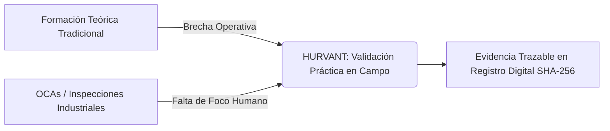

# FASE 1: ESTRATEGIA GLOBAL DE MARCA Y LANZAMIENTO NACIONAL
## HURVANT Certification & Technical Validation

**Fecha de emisión:** Julio 2026  
**Autor:** Equipo de Dirección Estratégica, Creativa y Marketing Global  
**Proyecto:** Lanzamiento Oficial de Hurvant en España (Quincena de Septiembre 2026)  
**Clasificación:** Estratégico / Confidencial Corporativo  

---

## 1. ESTUDIO DE MARCA (BRAND AUDIT)

### 1.1. Contexto de Mercado y Oportunidad
El mercado español de evaluación industrial, prevención de riesgos laborales (PRL) y certificación de personal se encuentra actualmente polarizado en dos extremos ineficientes:

1. **La burocracia documental y de formación tradicional:** Entidades de formación y servicios de prevención que emiten miles de "certificados de asistencia" teóricos sin verificar si el trabajador sabe operar de forma segura y eficiente en el entorno real de trabajo.
2. **Las inspecciones OCD / OCA obligatorias:** Organismos autorizados centrados exclusivamente en trámites ministeriales e inspecciones periódicas de plantilla estática, con nula integración de trazabilidad digital e incapacidad de evaluar el comportamiento humano dinámico.

**Hurvant** nace para ocupar el espacio estratégico más valioso: la **evaluación técnica independiente de tercera parte**, enfocada en la aptitud operativa real, la adecuación de maquinaria (RD 1215/1997), los ensayos no destructivos (NDT/END) y la mitigación de la responsabilidad penal corporativa del empresario.



### 1.2. ADN de Marca
- **Propósito Fundamental:** Blindar jurídicamente a las organizaciones y proteger la vida de los operarios verificando en el puesto real si las personas y las máquinas están capacitadas para operar en entornos de alta exigencia.
- **Misión:** Transformar la verificación de competencias y adecuación técnica en España, reemplazando el papel inerte por pruebas observacionales empíricas y trazabilidad criptográfica inalterable.
- **Visión:** Convertirse en el plazo de 36 meses en la entidad técnica de validación independiente de referencia en España, logrando la acreditación formal por ENAC bajo las normas UNE-EN ISO/IEC 17024 e ISO/IEC 17020.
- **Valores Corporativos:**
  - *Rigor Científico:* Evaluación basada exclusivamente en datos objetivos, normativas UNE/ISO y pruebas físicas in-situ.
  - *Imparcialidad Radicada:* Separación absoluta de actividades (no impartir formación, no hacer consultoría PRL, no alquilar maquinaria).
  - *Inmutabilidad Digital:* Registro transparente de dictámenes mediante firmas criptográficas SHA-256 y códigos QR de verificación pública.
  - *Humanismo Técnico:* Comprensión del ajuste ergonómico y psicofísico entre el trabajador y su puesto.

---

## 2. POSICIONAMIENTO ESTRATÉGICO

### 2.1. Declaración de Posicionamiento (Positioning Statement)
> *Para directores de operaciones, responsables de prevención (HSE/PRL), directores de compras y administradores de empresas exigentes en España que sufren por la alta rotación, las inspecciones laborales y la falta de control sobre los riesgos de campo:*  
> **HURVANT es la entidad técnica independiente de tercera parte** que valida de forma empírica y observacional la competencia real de operarios y la seguridad física de equipos industriales (RD 1215/97), a diferencia de las academias de formación tradicional o consultoras de papel, proporcionando evidencias inalterables con trazabilidad digital instantánea que garantizan la diligencia debida corporativa.

### 2.2. Ejes de Diferenciación
| Dimensión | Competencia Tradicional | HURVANT |
| :--- | :--- | :--- |
| **Objeto de Evaluación** | Asistencia teórica / Examen escrito genérico | Desempeño y habilidad funcional observable en el puesto real |
| **Gobernanza** | Conflicto de interés (venden formación y evalúan) | Separación total de actividades + Comité de Imparcialidad externo |
| **Trazabilidad** | Certificados en papel / PDFs editables | Firma criptográfica SHA-256 + Código QR de verificación RGPD |
| **Respuesta ante Inspección** | Justificante de asistencia a curso | Dossier técnico de Diligencia Debida con valor probatorio |
| **Enfoque Tecnológico** | Burocracia lenta manual | Plataforma SaaS corporativa + Pasaporte Técnico Móvil |

---

## 3. PÚBLICO OBJETIVO Y BUYER PERSONAS

### 3.1. Segmentación de Mercado (B2B)
- **Sector Primario / Directo:** Logística, Distribución, Almacenamiento Automatizado, Gran Consumo.
- **Sector Industrial Crítico:** Industria Metalúrgica, Química, Manufactura Pesada, Operaciones de Izaje y Grúas.
- **Sector Infraestructuras:** Construcción, Obra Civil, Energías Renovables (Eólica y Solar).

### 3.2. Buyer Personas Detallados

#### Persona 1: Francisco "El Director de Prevención y Compliance"
- **Cargo:** Director de HSE / Responsable de PRL Corporativo.
- **Edad / Perfil:** 44 años, Ingeniero Técnico, 15+ años en el sector industrial o logístico.
- **Metas:** Cero accidentes graves en planta, superar auditorías e inspecciones laborales sin sanciones, blindar la responsabilidad penal propia y del Consejo de Administración.
- **Puntos de Dolor (Pains):**
  - Los operarios contratados por ETT traen diplomas de "carretillero" de 8 horas pero en el primer día dañan estanterías o maniobran sin seguridad.
  - Gran volumen de papeleo CAE no verificado técnicamente.
  - Miedo constante a un accidente grave que derive en recargo de prestaciones o juzgado de lo penal.
- **Mensaje Clave para Francisco:** *"HURVANT te proporciona evidencias probatorias inalterables de que evaluaste la habilidad real del operario en su puesto de trabajo antes de darle acceso a la máquina."*

#### Persona 2: Manuel "El Director de Operaciones y Planta"
- **Cargo:** Director de Operaciones / Jefe de Planta / COO.
- **Edad / Perfil:** 49 años, enfocado en margen operativo, OEE (Overall Equipment Effectiveness) y tiempos de entrega.
- **Metas:** Máxima productividad, minimizar paradas de línea por fallos de maquinaria o bajas laborales, reducir rotación de personal en turnos de picos de demanda.
- **Puntos de Dolor (Pains):**
  - No puede permitir que una auditoría externa paralice la planta durante dos días.
  - La rotación constante de personal temporal ralentiza el ritmo de salida del almacén.
  - Incertidumbre sobre el estado mecánico real de equipos antiguos o subcontratados.
- **Mensaje Clave para Manuel:** *"Evaluamos a tus operarios e inspeccionamos tus máquinas in-situ sin detener tus turnos productivos y entregamos el cuadro de mando en 14 días."*

---

## 4. PROPUESTA DE VALOR Y PROPUESTA ÚNICA DE VENTA (PUV)

### Propuesta Única de Venta (PUV)
**"Validación Técnica Inalterable en el Puesto Real: Evaluamos Competencias, No Asistencias."**

### Arquitectura de Valor
1. **Para la Dirección Jurídica y Compliance:** Blindaje de la Diligencia Debida con actas con huella digital SHA-256 e inmutabilidad probatoria.
2. **Para la Dirección de Recursos Humanos y PRL:** Matriz de competencias en tiempo real (Skill Matrix) accesible desde la nube para verificar si cada trabajador está apto, próximo a revisión o bloqueado.
3. **Para los Equipos de Campo:** Pasaporte Técnico de Competencias móvil mediante QR para verificación instantánea en centros de trabajo y obras.

---

## 5. ESTRATEGIA DE COMPETENCIA Y MATRIZ COMPETITIVA

```
                   ALTO RIGOR TÉCNICO & TRAZABILIDAD
                                  │
                                  │       🔵 HURVANT
                                  │   (Validación 3ª Parte + SaaS + NDT)
                                  │
   BUROCRÁTICO / LENTO ───────────┼─────────── DIGITAL / ÁGIL
                                  │
      🔴 OCAs / Entidades         │       🟡 Plataformas Software CAE
         Tradicionales            │          (Dokify, CTAIMA, e-coordina)
                                  │
                                  │
      🔴 Academias Formación      │
         y Servicios PRL          │
                                  │
                   BAJO RIGOR TÉCNICO & EVALUACIÓN TEÓRICA
```

### Estrategia de Flanqueo Competitivo
- **Frente a las Academias PRL:** No competimos en "vender cursos". Apoyamos a la empresa en verificar si el curso sirvió de algo evaluando la práctica en campo.
- **Frente a Software CAE:** No somos un simple gestor de documentos; somos los ingenieros e inspectores que auditan in-situ la veracidad física de lo que se sube a la plataforma.

---

## 6. ESTRATEGIA DE LANZAMIENTO, CAPTACIÓN Y CRECIMIENTO

### 6.1. Estrategia de Prelanzamiento y Lanzamiento (Agosto - Septiembre 2026)
- **Campañas Teaser B2B en LinkedIn:** Publicación de artículos de autoridad firmados sobre la "Responsabilidad Penal del Director de Compras ante Accidentes con Maquinaria Alquilada".
- **Despliegue del Programa Piloto Gratuito (10 Grandes Cuentas):** Implementación del piloto en 10 empresas tractoras del sector logístico en Cataluña para generar los primeros casos de éxito y datos empíricos de reducción de incidencias.
- **Nota de Prensa Nacional:** Difusión en medios económicos y sectoriales (*Expansión, El Economista, Cadena de Suministro, Interempresas*) anunciando la irrupción de Hurvant como nuevo referente de validación técnica independiente.

### 6.2. Estrategia de Captación Inbound & Outbound

```mermaid
graph TD
    A[Estrategia de Captación B2B] --> B(Outbound Account-Based Marketing)
    A --> C(Inbound Authority Marketing)
    
    B --> B1[Campañas LinkedIn InMail a Directores HSE y COO]
    B --> B2[Secuencias Email C-Level Personalizadas]
    B --> B3[Llamadas de Cualificación Técnica SLA 24h]
    
    C --> C1[Google Search Ads para Keywords de Alta Intención]
    C C2[Lead Magnets: Guía de Inspección RD 1215/97]
    C --> C3[Blog Técnico SEO Jurisprudencia PRL]
```

### 6.3. Estrategia de Crecimiento Agresivo (Growth Engine)
1. **Efecto Red por Pasaporte Técnico QR:** Cada vez que un operario de Hurvant muestra su QR en la planta de un cliente o contratista, el responsable que lo escanea descubre la consola de verificación de Hurvant, actuando como un canal viral B2B.
2. **Integración API con Plataformas CAE:** Conexión automatizada con proveedores de software CAE para que un operario certificado por Hurvant quede automáticamente validado en el sistema del cliente.
3. **Venta Cruzada (Cross-selling):** Clientes que contratan la inspección de maquinaria RD 1215 son convertidos a la evaluación de competencias de sus carretilleros y ensayos NDT de sus grúas.

---

## 7. OBJETIVOS SMART Y KPIS MEDIBLES

### 7.1. Objetivos SMART (Primeros 6 Meses: Septiembre 2026 - Febrero 2027)

> [!IMPORTANT]
> **Objetivo 1 (Notoriedad y Marca):** Alcanzar más de 250.000 impresiones cualificadas B2B en LinkedIn y Google Display en el sector industrial y logístico de España antes del 31 de diciembre de 2026.

> [!IMPORTANT]
> **Objetivo 2 (Lead Generation):** Generar al menos 45 solicitudes calificadas (SQL) de Programas Piloto y Auditorías de Maquinaria durante los primeros 90 días tras el lanzamiento.

> [!IMPORTANT]
> **Objetivo 3 (Conversión y Clientes):** Cerrar 15 contratos corporativos recurrentes de validación operativa en el primer trimestre post-lanzamiento.

> [!IMPORTANT]
> **Objetivo 4 (Autoridad SEO):** Posicionar en TOP 3 de Google España al menos 8 palabras clave estratégicas relacionadas con *adecuación RD 1215/97*, *evaluación de competencias operativas* y *ensayos no destructivos grúas*.

### 7.2. Cuadro de Mandos de KPIs

| Área | KPI Principal | Meta Mensual (M1-M3) | Frecuencia de Medición |
| :--- | :--- | :--- | :--- |
| **Branding & PR** | Menciones en medios / Alcance LinkedIn | 50.000 impresiones | Semanal |
| **SEO Orgánico** | Tráfico orgánico B2B / CTR en Search | 2.500 visitas / CTR > 4.5% | Semanal |
| **Publicidad Ads** | CPL (Coste por Lead Cualificado B2B) | < 45 € en Google / < 75 € LinkedIn | Diario |
| **Ventas / Growth** | Solicitudes de Piloto / Tasa de Conversión | 15 leads SQL / > 25% conversión | Mensual |
| **Operación** | Emisión de Certificados con QR | > 300 operarios/mes | Mensual |

---

## 8. CALENDARIO GENERAL (TIMELINE MASTER)

```gantt
    title Plan Maestro de Lanzamiento Hurvant (2026)
    dateFormat  YYYY-MM-DD
    section FASE 1: Estrategia
    Estrategia Global & Aprobación       :done,    des1, 2026-07-24, 2026-07-28
    section FASE 2: Identidad
    Copywriting, Claims & Manual Voces   :active,  des2, 2026-07-29, 2026-08-05
    section FASE 3: Materiales
    Catálogo, Tríptico, Dossier PDF      :         des3, 2026-08-06, 2026-08-18
    section FASE 4: Digital & SEO
    Setup SEO, Blog & Redes Sociales     :         des4, 2026-08-19, 2026-08-31
    section FASE 5: Publicidad
    Creación de Campañas Ads             :         des5, 2026-09-01, 2026-09-10
    section FASE 6: Social Media
    Producción Bloques de Contenido      :         des6, 2026-09-11, 2026-09-17
    section FASE 7: Lanzamiento
    LANZAMIENTO OFICIAL & NOTA DE PRENSA :crit,    des7, 2026-09-18, 2026-09-30
```

---

## CONCLUIDA LA FASE 1: ESTRATEGIA GLOBAL

Este documento establece el marco estratégico sobre el cual se construirá toda la producción de contenidos, materiales impresos, campañas de publicidad digital y calendarios editoriales de las siguientes fases.

---
