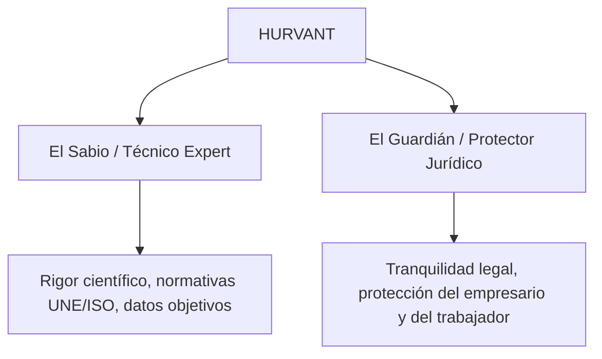

# FASE 2: IDENTIDAD COMERCIAL Y MANUAL DE COMUNICACIÓN
## HURVANT Certification & Technical Validation

**Fecha de emisión:** Julio 2026  
**Autor:** Dirección Creativa, Copywriting & Branding Senior  
**Proyecto:** Lanzamiento Oficial de Hurvant en España  
**Estado:** Entregable Oficial de Agencia — Fase 2  

---

## 1. MENSAJE PRINCIPAL (CORE BRAND MESSAGE)

### 1.1. Mensaje Institucional de Marca (Brand Core Message)
> **"En HURVANT creemos que la seguridad operativa y el rendimiento empresarial no se garantizan en un aula ni se firman sobre papel inerte. Se demuestran en el puesto real de trabajo. Somos la entidad técnica independiente que evalúa con rigor la capacidad observada de las personas, audita la adecuación física de la maquinaria y certifica la inmutabilidad de cada evidencia con trazabilidad digital."**

### 1.2. Mensaje de Lanzamiento Nacional (Campaign Launch Message)
> **"Llega a España una nueva era en la validación técnica industrial: sin burocracia vacía, sin conflictos de interés y sin espacio para la duda. HURVANT conecta la evaluación práctica en campo con la tranquilidad jurídica que exige la alta dirección."**

### 1.3. Mensajes Específicos por Perfil de Interlocutor

#### A. Para el Director de Prevención, Compliance y Asesoría Jurídica (HSE / Legal)
*   **Mensaje:** *"Ante una inspección de trabajo o un procedimiento judicial, un diploma de asistencia a un curso no demuestra la aptitud de tu operario. HURVANT te aporta evidencias técnicas e inalterables con firma criptográfica que prueban tu diligencia debida corporativa."*

#### B. Para el Director de Operaciones, Planta y Cadena de Suministro (COO / Plant Manager)
*   **Mensaje:** *"Reducir siniestralidad no significa frenar la producción. Evaluamos las competencias de tus equipos e inspeccionamos tus máquinas in-situ, sin interrumpir tus turnos y detectando cuellos de botella ergonómicos antes de que se conviertan en bajas."*

#### C. Para el Director de Recursos Humanos y Selección (CHRO / Talent Manager)
*   **Mensaje:** *"No permitas que la alta rotación de ETT o personal temporal degrade la calidad operativa de tus centros. Ofertamos esquemas de validación de competencias objetivas que aseguran el encaje persona-puesto desde el primer día."*

---

## 2. ESLOGAN Y CLAIMS CORPORATIVOS

### 2.1. Eslogan Principal de Marca (Main Tagline)
```
┌─────────────────────────────────────────────────────────────┐
│                                                             │
│         HURVANT: Evaluamos Competencias, No Asistencias.    │
│                                                             │
└─────────────────────────────────────────────────────────────┘
```
*Variante alternativa institucional:*  
`HURVANT | Rigor Técnico, Imparcialidad y Trazabilidad en Campo.`

### 2.2. Claims Secundarios por Línea de Servicio

#### 1. Certificación y Evaluación Operativa de Personas
- *"El valor de saber operar en el mundo real."*
- *"De la teoría del papel a la evidencia en campo."*
- *"Pasaporte Técnico QR: la competencia de tu equipo, verificable al instante."*

#### 2. Inspección y Adecuación de Maquinaria (RD 1215/1997)
- *"Maquinaria conforme, producción blindada."*
- *"La adecuación técnica que protege a tu personal y a tu dirección."*
- *"Placa de validación QR: el sello inalterable de seguridad en planta."*

#### 3. Ensayos No Destructivos (NDT / END)
- *"Detectamos lo invisible antes de que impacte en tu operación."*
- *"Integridad estructural verificada por ultrasonidos e inspección instrumental."*

#### 4. Programas Piloto de Validación
- *"Demuestra la reducción de riesgo en 14 días sin detener tu producción."*

### 2.3. Claims Rápidos para Redes Sociales y Publicidad (Social & Ads Headlines)
- *"¿Seguro que tus carretilleros saben operar o solo asistieron a un curso?"*
- *"Evita el recargo de prestaciones: blinda tu responsabilidad legal con evidencias SHA-256."*
- *"Cero papel. Cero dudas. Verificación de competencia por código QR."*
- *"Adecuación RD 1215/97 con dictamen de ingeniería inmutable."*

---

## 3. VOZ DE MARCA Y ARQUETIPOS DE BRANDING

### 3.1. Arquetipos Combinados de Marca
HURVANT se posiciona en el cruce de dos arquetipos fundamentales:



1. **El Sabio (The Sage):** APORTA AUTORIDAD Y RIGOR. Domina la legislación española (Ley de PRL, RD 1215/97, Directivas de Máquinas) y las normas internacionales (ISO 17024, ISO 17020, ISO 9712). Habla con precisión técnica milimétrica, sin vacilaciones.
2. **El Guardián (The Protector):** APORTA SEGURIDAD Y TRANQUILIDAD. Es firme en la defensa de los estándares de seguridad. Protege al administrador de la empresa de riesgos penales y al operario de sufrir lesiones en entornos de alta exigencia.

### 3.2. Personalidad de Marca
- **Autoritaria pero Accesible:** No usa jerga innecesaria para intimidar, sino términos normativos precisos para dar certidumbre.
- **Tecnológica e Incorruptible:** Refleja la inmutabilidad de la ciencia y la encriptación digital.
- **Empática con la Operación:** Entiende que las empresas necesitan producir y entregar a tiempo, y no pretende ser un obstáculo burocrático, sino un facilitador de excelencia.

---

## 4. TONO DE COMUNICACIÓN (THE 4 PILLARS OF HURVANT'S VOICE)

### Pillar 1: Riguroso y Técnico (Scientific & Normative)
- **Definición:** Nos basamos en normativas reales, reales decretos y metodologías observacionales probadas.
- **Cómo se aplica:** Citamos siempre los estándares (RD 1215/1997, ISO/IEC 17024, UNE-EN ISO 9712). No usamos adjetivos vacíos como "el mejor servicio" o "excelente calidad". Demostramos la calidad mediante parámetros.

### Pillar 2: Inalterable y Transparente (Cryptographic & Fair)
- **Definición:** Transmitimos la neutralidad absoluta de una entidad de tercera parte.
- **Cómo se aplica:** Subrayamos la separación de actividades (no vendemos formación, no vendemos máquinas). Hablamos de "dictámenes objetivos", "firmas criptográficas SHA-256" y "verificación pública por QR".

### Pillar 3: Humano y Ergonómico (Operational Wellbeing)
- **Definición:** Entendemos que detrás de cada riesgo hay una persona trabajando en condiciones físicas exigentes.
- **Cómo se aplica:** Abordamos el bienestar y la adaptación ergonómica no como una moda, sino como un factor directo de reducción de siniestralidad e ineficiencia.

### Pillar 4: Directo y Orientado al Negocio (Executive & Action-Driven)
- **Definición:** Respetamos el tiempo de los directores C-Level.
- **Cómo se aplica:** Redacción clara, párrafos cortos, viñetas estructuradas y llamadas a la acción claras (CTA).

---

## 5. MANUAL DE CONTROL VERBAL Y DICCIONARIO EDITORIAL

Para mantener una coherencia absoluta en todas las piezas comerciales, notas de prensa, landing pages y campañas publicitarias, se establece el siguiente código verbal de obligado cumplimiento:

### 5.1. Diccionario de Términos Aprobados vs Prohibidos

| 🚫 PALABRAS PROHIBIDAS (EVITAR SIEMPRE) | ️✅ TÉRMINOS OFICIALES HURVANT (USAR SIEMPRE) | RAZÓN TÉCNICO-LEGAL Y DE BRANDING |
| :--- | :--- | :--- |
| "Curso de formación" / "Academia" | **"Esquema de evaluación de competencias"** / **"Validación observacional en campo"** | HURVANT no es una academia. Evalúa el desempeño práctico en el puesto real. |
| "Certificado oficial" / "Homologado ENAC" | **"Dictamen técnico emitido bajo esquema alineado con ISO 17024"** | Evita la suplantación de ENAC en la fase previa, manteniendo un posicionamiento de alta exigencia internacional. |
| "Aprobado" / "Apto" (sin matiz) | **"Evidencia técnica de competencia operativa demostrada"** | Denota que la conformidad se apoya en datos objetivos registrados en tabletas de inspección. |
| "Papeleo de PRL" / "Burocracia" | **"Dossier de Diligencia Debida e inmutabilidad documental"** | Eleva el valor percibido del trabajo de PRL a la esfera de la protección jurídica de la alta dirección. |
| "Servicio barato / económico" | **"Intervención de alto impacto y cero fricción operativa"** | Preserva el posicionamiento Premium de alta consultoría tecnológica. |
| "Ayudamos a la empresa" | **"Validamos de tercera parte de forma imparcial e independiente"** | Subraya la neutralidad radical requerida por la ISO 17020 e ISO 17024. |

---

## 6. GUÍA DE APLICACIÓN PRÁCTICA POR CANAL

### 6.1. Guía de Redacción para Emails Corporativos (Outbound B2B)
- **Asunto:** Debe apelar al riesgo o al cumplimiento del cargo del interlocutor.  
  *Ejemplo:* `[Compliance PRL] Evidencia de adecuación RD 1215/97 para la planta de Barcelona`
- **Cuerpo:** Máximo 150 palabras. Estructura: Problema del sector → Solución Hurvant → Evidencia (QR/SHA-256) → CTA claro para reunión de 15 min o Piloto.
- **Cierre:** Firma corporativa homologada con cargo técnico y link al verificador de certificados.

### 6.2. Guía de Estilo para Publicaciones en Redes Sociales (LinkedIn / Instagram / X)
- **LinkedIn (Canal Principal B2B):** Tono analítico, jurisprudencial y técnico. Uso de datos del INSST, referencias a sentencias del Tribunal Supremo sobre responsabilidad patronal y desgloses metodológicos.
- **Instagram / TikTok (Canal Visual y Humano):** Tono enfocado a mostrar la realidad del campo: inspectores realizando ensayos NDT con ultrasonidos, explicaciones visuales de resguardos mecánicos y valorización del trabajo del operario seguro.
- **YouTube:** Micro-documentales técnicos sobre cómo superar una inspección de maquinaria RD 1215 o cómo realizar un ensayo de líquidos penetrantes en grúas.

### 6.3. Guía para la Atención Comercial y Pitch de Ventas (1 Minute Elevator Pitch)

> *"Hola [Nombre]. En HURVANT ayudamos a directores de operaciones y prevención a resolver una brecha crítica: el 90% de los operarios que sufren accidentes con maquinaria disponían de un título teórico, pero nadie había evaluado su comportamiento práctico real en el centro de trabajo.*  
>  
> *Nosotros enviamos inspectores técnicos que evalúan la habilidad operativa del personal in-situ y auditan la adecuación física de la maquinaria según el Real Decreto 1215/97, emitiendo dictámenes firmados criptográficamente con código QR de verificación instantánea.*  
>  
> *Esto te aporta dos cosas de inmediato: la seguridad de que tus plantas operan sin fallos humanos costosos y el blindaje de la responsabilidad penal de tu dirección ante cualquier inspección de trabajo.*  
>  
> *¿Te parecería bien que coordinemos una breve prueba piloto de 14 días en uno de tus turnos para mostrarte el informe técnico de riesgo?"*

---

## CONCLUIDA LA FASE 2: IDENTIDAD COMERCIAL

Este documento fija el lenguaje, tono, claims y directrices verbales con los que se redactarán los materiales impresos (Fase 3), estrategias digitales (Fase 4), anuncios (Fase 5), calendarios editoriales (Fase 6) y contenidos del Lanzamiento (Fase 7).

---
