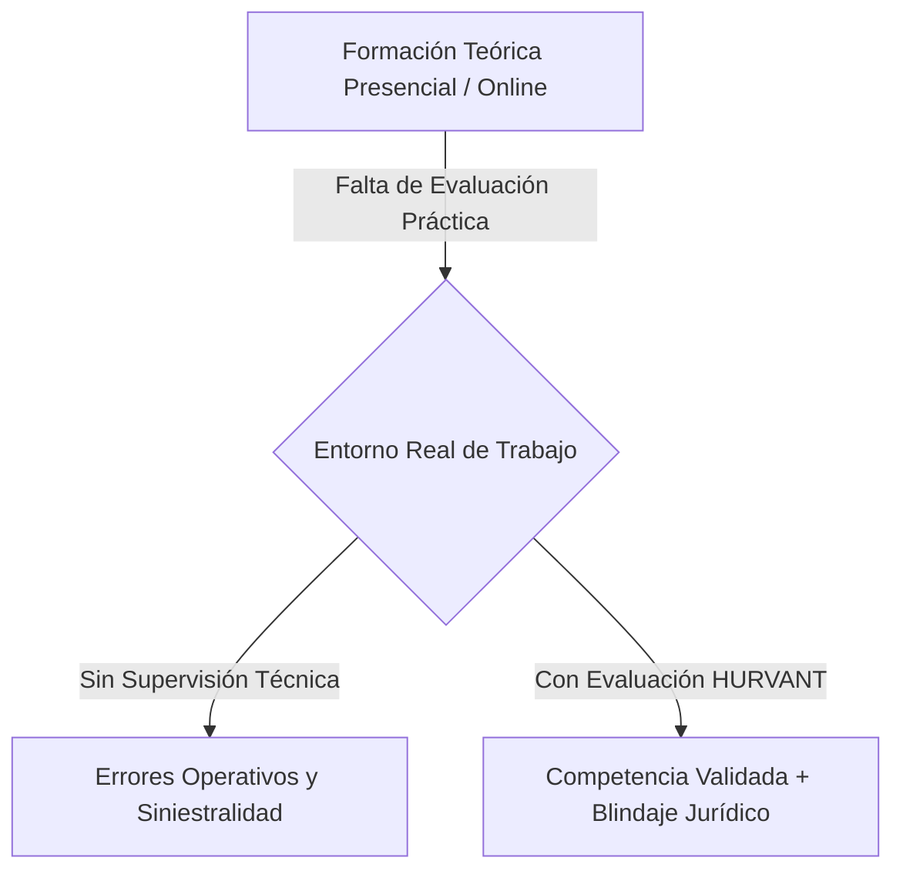
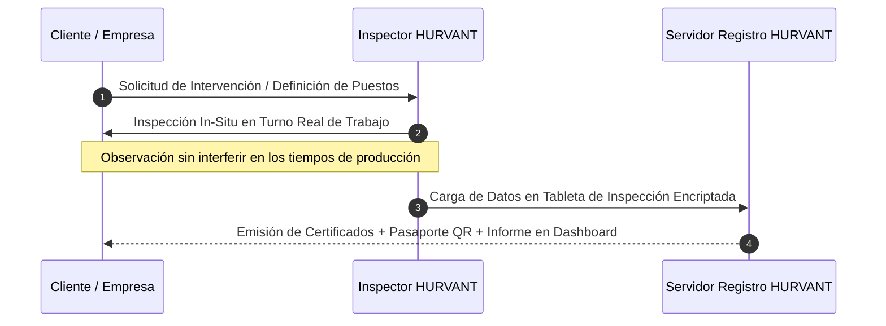

# CATÁLOGO CORPORATIVO INSTITUCIONAL
## HURVANT Certification & Technical Validation
*Edición Oficial 2026 / 2027 — Documentación de Tercera Parte*

```
================================================================================
                                 H U R V A N T
                    ORGANISMO TÉCNICO DE CERTIFICACIÓN
                         Y VALIDACIÓN EN CAMPO
================================================================================
                  EVALUAMOS COMPETENCIAS, NO ASISTENCIAS.
================================================================================
```

---

## ÍNDICE DEL DOCUMENTO

1. **BIENVENIDA INSTITUCIONAL**  
   1.1. Carta de la Dirección General  
   1.2. Manifiesto del Rigor Técnico  

2. **HISTORIA Y PROPÓSITO DE HURVANT**  
   2.1. El Origen: El Vacío en la Evaluación Industrial Española  
   2.2. Misión, Visión y Trascendencia  

3. **GOBERNANZA E IMPARCIALIDAD RADICAL**  
   3.1. Declaración de Imparcialidad y Separación de Actividades  
   3.2. Comité de Salvaguarda de la Imparcialidad  
   3.3. Estándares Regulatorios (UNE-EN ISO/IEC 17024 e ISO/IEC 17020)  

4. **PORTAFOLIO DE SERVICIOS TÉCNICOS DE EVALUACIÓN**  
   4.1. Esquema E-HVT-01: Evaluación Operativa de Personas en Campo  
   4.2. Esquema E-HVT-02: Inspección y Adecuación de Maquinaria (RD 1215/1997)  
   4.3. Esquema E-HVT-03: Ensayos No Destructivos (NDT / END - ISO 9712)  
   4.4. Esquema E-HVT-04: Auditoría de Eficacia Preventiva de Campo (Compliance PRL)  
   4.5. Esquema E-HVT-05: Verificación Documental Avanzada y CAE  

5. **METODOLOGÍA DE INTERVENCIÓN EN CAMPO**  
   5.1. Protocolo de 4 Fases de Evaluación In-Situ  
   5.2. Cero Fricción Operativa: Evaluación en Turno Real  

6. **ECOSISTEMA TECNOLÓGICO DE TRAZABILIDAD DIGITAL**  
   6.1. Portal Corporativo SaaS de Empresas (Cuadro de Mando Ledger)  
   6.2. Pasaporte Técnico del Trabajador (Acreditación Móvil por Código QR)  
   6.3. Firma Criptográfica SHA-256 e Inmutabilidad de Evidencias  

7. **SOLUCIONES SECTORIALES EN ESPAÑA**  
   7.1. Sector Logística y Gran Distribución  
   7.2. Sector Heavy Industry, Grúas e Izaje  
   7.3. Sector Construcción e Infraestructuras  
   7.4. Sector Energías Renovables (Eólica y Fotovoltaica)  
   7.5. Sector Agroalimentario y Procesado Automatizado  

8. **DESPLIEGUE DE PROGRAMAS PILOTO CONTROLADOS**  
   8.1. Estructura del Piloto de 14 Días  
   8.2. Entregables del Piloto y Garantía de Evaluación  

9. **MATRIZ COMPARATIVA DE VENTAJAS CORPORATIVAS**  

10. **PREGUNTAS FRECUENTES TÉCNICAS Y JURÍDICAS (FAQ)**  

11. **CANALES OFICIALES Y CONTACTO INSTITUCIONAL**  

---

## 1. BIENVENIDA INSTITUCIONAL

### 1.1. Carta de la Dirección General
Estimado directivo, profesional de la prevención y responsable operativo:

El desarrollo de la industria moderna en España exige niveles de precisión, seguridad y productividad sin precedentes. Sin embargo, paradójicamente, el modelo tradicional de verificación del factor humano y de los equipos de trabajo ha quedado anclado en la burocracia documental del siglo pasado.

Durante décadas, las organizaciones han confiado la seguridad de sus plantas y almacenes a diplomas teóricos de asistencia y a carpetas de prevención archivadas que nadie lee en el día a día. Las consecuencias de esta brecha son conocidas por cualquier director de planta: siniestralidad recurrente, rotación acelerada de personal temporero, daños en maquinaria exigente y una vulnerabilidad jurídica crítica para los administradores ante una inspección de trabajo.

**HURVANT** nace como la respuesta técnica de tercera parte que el mercado español demandaba. No somos una academia de formación ni comercializamos maquinaria. Somos ingenieros e evaluadores independientes apasionados por el rigor empírico. Nuestra labor es evaluar directamente en el puesto real si una persona sabe operar de forma segura y si una máquina cumple físicamente con los estándares normativos.

Le invitamos a conocer en este catálogo una metodología concebida para aportar dos activos de incalculable valor a su organización: **excelencia en la operación diaria y tranquilidad absoluta ante la ley.**

*Fdo. Dirección General de HURVANT Certification*

---

## 2. HISTORIA Y PROPÓSITO DE HURVANT

### 2.1. El Origen: El Vacío en la Evaluación Industrial Española
HURVANT surge del análisis directo de la siniestralidad industrial y logística en España. Las estadísticas de la Inspección de Trabajo reflejan de forma constante una realidad incontestable: **más del 90% de los trabajadores involucrados en incidentes graves con maquinaria disponían del certificado de formación teórica legalmente exigido.**

El problema no radica en la falta de cursos, sino en la **ausencia de verificación práctica de competencias en contexto real de fatiga, presión y exigencia ergonómica**. HURVANT fue creada para cerrar de manera definitiva este vacío entre la teoría del aula y la realidad del centro de trabajo.



---

## 3. GOBERNANZA E IMPARCIALIDAD RADICAL

### 3.1. Declaración Institucional de Imparcialidad
Para garantizar que nuestros dictámenes e informes técnicos tengan pleno valor probatorio frente a inspecciones laborales y tribunales de justicia, HURVANT mantiene una **separación radical de actividades**:

> 🛑 **HURVANT NO IMPARTE FORMACIÓN PREPARATORIA.**  
> 🛑 **HURVANT NO PRESTA ASESORÍA TÉCNICA O COMERCIAL EN PRL.**  
> 🛑 **HURVANT NO DISTRIBUYE, VENDE NI ALQUILA MAQUINARIA O EQUIPOS.**  

Esta neutralidad absoluta asegura que nuestros evaluadores no tengan conflicto de interés alguno al examinar a un trabajador o auditar una máquina.

### 3.2. Comité de Salvaguarda de la Imparcialidad
HURVANT está supervisada por un **Comité de Imparcialidad externo e independiente**, integrado por representantes de Colegios Oficiales de Ingenieros, técnicos de prevención de reconocido prestigio y asociaciones de usuarios industriales. Este órgano ostenta plena potestad para revisar los expedientes técnicos de validación y paralizar cualquier dictamen que no cumpla con el rigor exigido.

---

## 4. PORTAFOLIO DE SERVICIOS TÉCNICOS DE EVALUACIÓN

```
+-----------------------------------------------------------------------------------+
|               CATÁLOGO DE ESQUEMAS TÉCNICOS DE EVALUACIÓN HURVANT                |
+-----------------------------------------------------------------------------------+
|  ESQUEMA E-HVT-01  |  Evaluación Operativa y Certificación de Personas (ISO 17024)|
|  ESQUEMA E-HVT-02  |  Inspección y Adecuación de Maquinaria (RD 1215/1997)         |
|  ESQUEMA E-HVT-03  |  Ensayos No Destructivos (NDT / END - ISO 9712)               |
|  ESQUEMA E-HVT-04  |  Auditoría de Eficacia Preventiva de Campo (Compliance PRL)   |
|  ESQUEMA E-HVT-05  |  Verificación Documental Avanzada y Control CAE              |
+-----------------------------------------------------------------------------------+
```

---

### 4.1. ESQUEMA E-HVT-01: Evaluación Operativa y Certificación de Personas

#### Descripción del Servicio
Procedimiento de evaluación observacional in-situ diseñado para medir las capacidades prácticas reales, la técnica de manipulación, la postura ergonómica y el comportamiento seguro de los operarios en su puesto físico de trabajo.

#### Equipos y Perfiles Evaluados
- Operadores de Carretillas Elevadoras (Frontal, Retráctil, Bilateral, Trilateral).
- Operadores de Plataformas Elevadoras Móviles de Personal (PEMP).
- Operadores de Puentes Grúa y Grúas Mástil.
- Personal de Manipulación de Cargas Pesadas y Logística de Frío.
- Operadores de Líneas Automatizadas y Envasado Industrial.

#### Entregables Técnicos
1. **Certificado Individual de Competencia Operativa:** Documento oficial con código de registro único e inalterable.
2. **Pasaporte Técnico QR Digital:** Acreditación móvil con fotografía del operario accesible desde cualquier teléfono inteligente.
3. **Informe de Brechas de Desempeño:** Ficha cuantitativa entregada a la dirección con indicación de hábitos correctivos recomendados.

---

### 4.2. ESQUEMA E-HVT-02: Inspección y Adecuación de Maquinaria (RD 1215/1997)

#### Descripción del Servicio
Auditoría técnica e inspección física detallada de máquinas y equipos de trabajo para certificar su plena conformidad con las disposiciones del Real Decreto 1215/1997.

#### Alcance de la Inspección
- Verificación física de resguardos, protecciones mecánicas y vallados perimetrales.
- Inspección de circuitos de mando, paradas de emergencia y dispositivos LOTO.
- Pruebas dinámicas de estabilidad y sistemas de limitación de carga.
- Verificación de señalización, manuales de instrucciones en castellano y marcado CE.

#### Entregables Técnicos
1. **Dictamen Técnico de Conformidad RD 1215/97:** Firmado por Ingeniero colegiado autor de la inspección.
2. **Placa Metálica / Vinílica con Código QR:** Fijada físicamente a la máquina para inspección rápida en planta.
3. **Matriz de Defectos Priorizada:** Clasificación de deficiencias en *Bloqueantes, Graves y Leves* con propuestas técnicas de ingeniería.

---

### 4.3. ESQUEMA E-HVT-03: Ensayos No Destructivos (NDT / END)

#### Descripción del Servicio
Inspección instrumental avanzada sin alteración ni daño del componente, orientada a detectar fisuras por fatiga, defectos en soldaduras y desgaste estructural en aparatos de elevación y construcciones metálicas.

#### Métodos de Ensayo Disponibles
- **Ultrasonidos (UT):** Medición de espesores y detección de defectos volumétricos internos (norma UNE-EN ISO 17640).
- **Partículas Magnéticas (MT):** Detección de grietas superficiales y subsuperficiales en elementos ferromagnéticos (ganchos, eslingas, estructuras).
- **Líquidos Penetrantes (PT):** Inspección de discontinuidades abiertas a la superficie en materiales no porosos.
- **Inspección Visual Avanzada (VT):** Análisis boroscópico y dimensional de uniones soldadas (norma UNE-EN ISO 17637).

#### Personal Certificado
Todas las inspecciones NDT son ejecutadas por técnicos especialistas certificados bajo la norma **UNE-EN ISO 9712 (Nivel II / Nivel III)**.

---

### 4.4. ESQUEMA E-HVT-04: Auditoría de Eficacia Preventiva de Campo (Compliance PRL)

#### Descripción del Servicio
Auditoría de tercera parte orientada a medir la "brecha de cumplimiento" entre el Plan de Prevención escrito en las oficinas y la realidad ejecutada por los trabajadores en las líneas de producción.

#### Resultados para la Dirección
- Mapa interactivo de riesgo humano por centro de trabajo.
- Diagnóstico de comportamientos de riesgo antes de que deriven en siniestros.
- Informe de Diligencia Debida para el Comité de Dirección y Consejo de Administración.

---

### 4.5. ESQUEMA E-HVT-05: Verificación Documental Avanzada y CAE Inteligente

#### Descripción del Servicio
Auditoría técnica de veracidad y vigencia documental para subcontratas y personal externo (Coordinación de Actividades Empresariales).

#### Cero Aprobaciones Automáticas
Técnicos cualificados de HURVANT revisan la veracidad de firmas, vigencias de aptitud médica y adecuaciones de maquinaria subcontratada, eliminando las validaciones administrativas ciegas.

---

## 5. METODOLOGÍA DE INTERVENCIÓN EN CAMPO



### Protocolo de 4 Fases
1. **Fase 1: Preparación y Alineación:** Definición de los perfiles de puesto y check-lists técnicos adaptados a la planta del cliente.
2. **Fase 2: Observación Directa en Campo:** Intervención presencial de evaluadores cualificados durante el turno de trabajo habitual.
3. **Fase 3: Procesamiento cuantitativo:** Clasificación de evidencias y análisis de riesgo mediante algoritmos de evaluación.
4. **Fase 4: Emisión de Dictámenes y Firma Digital:** Carga inmediata de expedientes firmados criptográficamente en la plataforma cliente.

---

## 6. ECOSISTEMA TECNOLÓGICO DE TRAZABILIDAD DIGITAL

### 6.1. Portal Corporativo SaaS de Empresas (Dashboard Ledger)
Un entorno web privado con estética de cuadro de mando técnico que permite a la dirección controlar el 100% de sus evidencias de seguridad:
- **Skill Matrix Global:** Estado de aptitud operativa de cada trabajador en tiempo real (Verde: Validado; Naranja: Próximo a vencer; Rojo: Bloqueado).
- **Gestión del Parque de Maquinaria:** Expediente único por máquina con sus informes RD 1215/97, actas NDT y vigencias.
- **Descarga de Dictámenes Firmados:** Repositorio de PDFs con firma criptográfica inmutable.

```
+-----------------------------------------------------------------------------------------+
|  HURVANT | Portal Corporativo (SaaS)            [Buscar operario, máquina...]       (👤) |
+-----------------------------------------------------------------------------------------+
| [⚡ Inicio]      | PANEL DE CONTROL GENERAL - COMPLIANCE OPERATIVO                       |
| [👥 Personal]    |                                                                       |
| [🚜 Equipos]     |  +-------------------+  +-------------------+  +-------------------+  |
| [📄 Informes]    |  | ÍNDICE DE APTITUD |  | CONTROL MAQUINARIA|  | ALERTAS CAE       |  |
|                  |  |      94.2%        |  | 42 / 45 Equipos   |  | 3 Subcontratas    |  |
|                  |  +-------------------+  +-------------------+  +-------------------+  |
|                  |                                                                       |
|                  |  ÚLTIMAS VALIDACIONES EMITIDAS CON QR                                 |
|                  |  +-----------------------------------------------------------------+  |
|                  |  | Operario        | Competencia Validada       | Estado  | QR Code |  |
|                  |  +-----------------+----------------------------+---------+---------+  |
|                  |  | Carlos Gómez    | Operador Carretilla Tipo 4 | ACTIVO  | [Ver QR]|  |
|                  |  | Marta Ruiz      | Espacios Confinados Cat. C | ACTIVO  | [Ver QR]|  |
|                  |  +-----------------------------------------------------------------+  |
+-----------------------------------------------------------------------------------------+
```

### 6.2. Pasaporte Técnico del Trabajador (Acreditación QR Móvil)
Cada operario evaluado por HURVANT recibe un código QR dinámico de alta seguridad. Cuando un coordinador de seguridad o cliente escanea el código en campo desde cualquier teléfono móvil, la plataforma devuelve una página de validación pública segura:

```
┌──────────────────────────────────────────────────────────┐
│  HURVANT | VERIFICACIÓN PÚBLICA DE COMPETENCIA           │
│                                                          │
│  👤 OPERARIO: Gómez Sánchez, Carlos                      │
│  🏢 EMPRESA: Logística del Norte S.L.                    │
│  🆔 REGISTRO: HVT-0982-2026                              │
│                                                          │
│  ✅ COMPETENCIAS VALIDADAS EN CAMPO:                     │
│  • Carretilla Elevadora Frontal/Retráctil  - ACTIVA      │
│  • Transpaleta Eléctrica Operador a Bordo - ACTIVA      │
│                                                          │
│  ⏱️ VINCULADO A REGISTRO CRIPTOGRÁFICO SHA-256           │
└──────────────────────────────────────────────────────────┘
```

---

## 7. SOLUCIONES SECTORIALES ESPECÍFICAS

### 7.1. Logística, Almacenes y Gran Distribución
- **Retos del sector:** Alta rotación por ETT, ritmo intenso de preparación de pedidos, accidentes por atropellos de carretilla y caída de pallets.
- **Solución HURVANT:** Evaluación práctica express in-situ de carretilleros, verificación de aptitud de personal temporal y marcado QR de adecuación RD 1215/97 en carretillas y retráctiles.

### 7.2. Industria Pesada, Metalurgia y Grúas
- **Retos del sector:** Izaje de grandes cargas, soldaduras sometidas a vibraciones y fatiga, riesgo de siniestro catastrófico.
- **Solución HURVANT:** Ensayos No Destructivos NDT (ultrasonidos y partículas magnéticas en ganchos/eslingas) y certificación de operadores de puente grúa.

### 7.3. Construcción y Obra Civil
- **Retos del sector:** Subcontratación en cascada, rotación constante de maquinaria alquilada, exigencias de diligencia debida del promotor.
- **Solución HURVANT:** Inspección previa a la puesta en marcha de excavadoras y grúas móviles, y Pasaporte Técnico QR para control de acceso en obra.

### 7.4. Energías Renovables (Eólica y Fotovoltaica)
- **Retos del sector:** Parques aislados, trabajos en altura extrema y personal subcontratado internacional.
- **Solución HURVANT:** Auditoría de seguridad técnica in-situ de los elementos de sujeción e izado en aerogeneradores y validación de competencia técnica de montadores.

---

## 8. DESPLIEGUE DE PROGRAMAS PILOTO CONTROLADOS

Para permitir a las grandes organizaciones probar la metodología HURVANT con **cero riesgo y cero fricción**, ofrecemos el **Programa Piloto de Validación Directa**:

```
+-----------------------------------------------------------------------------------+
|               ESTRUCTURA DEL PROGRAMA PILOTO CONTROLADO (14 DÍAS)                 |
+-----------------------------------------------------------------------------------+
|  1. Acotación: Selección de 1 turno o área de trabajo específica (10-20 operarios) |
|  2. Evaluación: 1 jornada de observación presencial de evaluadores HURVANT        |
|  3. Informe: Entrega de Matriz de Riesgo y Cuadro de Mando en 14 días             |
|  4. Garantía: Sin compromiso de permanencia ni cuotas obligatorias posteriores    |
+-----------------------------------------------------------------------------------+
```

---

## 9. MATRIZ COMPARATIVA DE VENTAJAS CORPORATIVAS

| Variable de Selección | Servicio PRL / Formación Genérica | HURVANT Certification |
| :--- | :--- | :--- |
| **Evaluación Práctica Real** | ❌ Nula (solo teoría presencial/online) | ✅ 100% Observacional en puesto real |
| **Prueba en Juicio / Inspección** | ⚠️ Muy débil (simple firma de asistencia) | ✅ Máxima (Informe con huella SHA-256) |
| **Marcado Físico de Maquinaria** | ❌ No disponible | ✅ Placa física con QR de validación |
| **Acceso a Cuadro de Mando SaaS** | ❌ PDFs dispersos por email | ✅ Dashboard corporativo unificado |
| **Control de Subcontratas** | ⚠️ Comprobación ciega administrativa | ✅ Verificación técnica real por expertos |

---

## 10. PREGUNTAS FRECUENTES TÉCNICAS Y JURÍDICAS (FAQ)

### ¿HURVANT sustituye a nuestro Servicio de Prevención de Riesgos (SPA/SPTP)?
**No, lo complementa y audita.** El SPA redacta la evaluación de riesgos y la planificación preventiva. HURVANT actúa como entidad de tercera parte independiente que evalúa si lo que está escrito en el papel se cumple realmente en el campo mediante pruebas prácticas y ensayos de maquinaria.

### ¿Tienen validez legal las evaluaciones de HURVANT ante la Inspección de Trabajo?
**Absolutamente.** Nuestros dictámenes están redactados por ingenieros y técnicos titulados bajo procedimientos conformes con normativas UNE-EN e ISO. Constituyen la mejor prueba documental de **Diligencia Debida** conforme al Código Penal (Art. 316-318) y a la Ley de Prevención de Riesgos Laborales.

### ¿Se interrumpe la producción durante la evaluación de nuestros operarios?
**En absoluto.** La metodología de HURVANT se basa en la observación observacional estructurada en el contexto real de trabajo. El evaluador acompaña al operario durante su actividad habitual sin ralentizar sus tiempos de entrega ni detener las máquinas.

---

## 11. CANALES OFICIALES Y CONTACTO INSTITUCIONAL

Para solicitar una propuesta técnica a medida o concertar la implantación de un **Programa Piloto de Validación**:

- 🏢 **Entidad:** HURVANT Certification & Technical Validation
- 📧 **Correo Electrónico Corporativo:** `hello@hurvant.com`
- ☎️ **Teléfono Sede Directa:** `+34 611 888 179`
- 🌐 **Portal Institucional:** [https://www.hurvant.com](https://www.hurvant.com)
- 🔒 **Consola de Verificación QR:** [https://www.hurvant.com/verificacion](https://www.hurvant.com/verificacion)
- 📍 **Área de Intervención Primaria:** Cataluña (Barcelona, Tarragona, Girona, Lleida) y Cobertura Nacional en España.

---

```
================================================================================
          © 2026 HURVANT Certification. Todos los derechos reservados.
           Documento Corporativo Oficial — Calidad e Imparcialidad.
================================================================================
```
