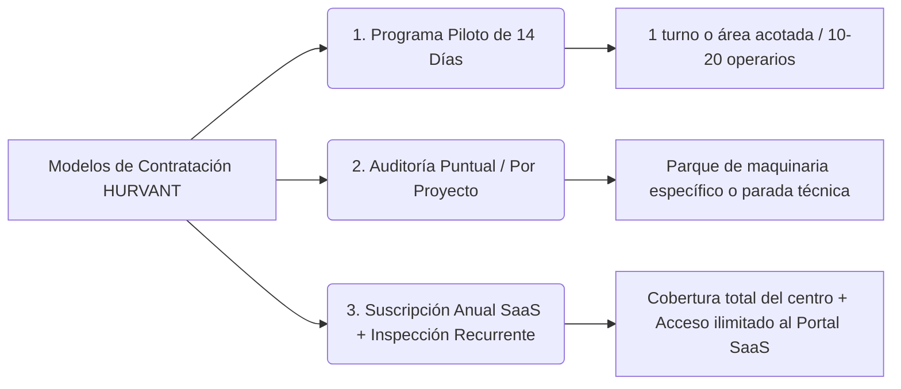

# DOSSIER COMERCIAL COMERCIAL EXECUTIVE (PDF FORMAT)
## HURVANT Certification & Technical Validation
*Propuesta Comercial y Dossier de Servicios para Dirección General, Operaciones y Compliance*

```
================================================================================
                               H U R V A N T
                DOSSIER DE PRESENTACIÓN COMERCIAL EJECUTIVA
                  SOLUCIONES DE VALIDACIÓN TÉCNICA Y COMPLIANCE
================================================================================
```

---

## 1. RESUMEN EJECUTIVO PARA LA ALTA DIRECCIÓN

Este dossier comercial presenta la propuesta de valor de **HURVANT Certification** para directores generales, directores de operaciones y responsables de prevención que buscan **reducir drásticamente la siniestralidad laboral, eliminar el desgaste operativo y blindar su responsabilidad legal** ante inspecciones de trabajo o procesos judiciales.

### El Reto de la Dirección en 2026
La formación tradicional y los certificados en papel ya no constituyen un escudo legal ni garantizan el rendimiento en planta. HURVANT aporta una **metodología de tercera parte basada en la evaluación observacional en el puesto real**, respaldada por una plataforma SaaS de trazabilidad con encriptación criptográfica SHA-256.

---

## 2. EL RETORNO DE INVERSIÓN (ROI) DE LA VALIDACIÓN HURVANT

```
+-----------------------------------------------------------------------------------+
|                        MÉTRICAS DE IMPACTO Y ROI ESTIMADO                         |
+-----------------------------------------------------------------------------------+
|  • Reducción de Daños en Maquinaria y Estanterías:      -65% en los primeros 6 meses|
|  • Reducción de Incidentes por Desajuste Ergonómico:   -40% en bajas temporales     |
|  • Ahorro en Tiempos de Gestión Documental CAE:        -80% gracias a integraciones  |
|  • Protección Legal de la Dirección (Art. 316 CP):     Blindaje con valor probatorio|
+-----------------------------------------------------------------------------------+
```

---

## 3. CATÁLOGOS DE SOLUCIONES Y MODELOS DE CONTRATACIÓN

### 3.1. Esquemas de Intervención

1. **E-HVT-01 | Evaluación Operativa de Personas (ISO 17024):** Evaluación in-situ en el puesto de trabajo. Certificado + Pasaporte Técnico QR.
2. **E-HVT-02 | Inspección de Maquinaria (RD 1215/1997):** Auditoría física, dictamen colegiado y placa metálica QR en máquina.
3. **E-HVT-03 | Ensayos No Destructivos (NDT / END):** Ultrasonidos, partículas magnéticas y líquidos penetrantes por técnicos ISO 9712.
4. **E-HVT-04 | Auditoría de Eficacia Preventiva:** Mapeo cuantitativo de riesgos humanos y cultura de campo.
5. **E-HVT-05 | Verificación Documental CAE Avanzada:** Auditoría técnica de subcontratas sin validaciones automáticas a ciegas.

---

### 3.2. Modelos de Contratación Comercial



#### Opción A: Programa Piloto Controlado (14 Días)
- **Alcance:** 10 a 20 operarios o equipos en 1 área acotada de la planta.
- **Entregables:** 1 jornada de observación presencial + Informe de Riesgo Ejecutivo + Acceso de prueba al Portal SaaS.
- **Inversión:** Tarifa plana promocional de lanzamiento sin compromiso posterior.

#### Opción B: Auditoría y Certificación por Proyecto
- **Alcance:** Adecuación completa RD 1215/97 de parque de maquinaria o campaña NDT de aparatos de elevación.
- **Inversión:** Presupuesto a medida según inventario de máquinas y centros de trabajo.

#### Opción C: Acuerdo Marco de Retainer Anual (Enterprise)
- **Alcance:** Cobertura integral para grandes centros logísticos e industriales (evaluación continua de operarios temporales ETT, inspecciones de maquinaria periódicas, soporte en inspecciones de trabajo).
- **Inversión:** Cuota mensual recurrente por centro con SLA garantizado de 24h.

---

## 4. ESTRUCTURA DEL DOSSIER VISUAL (ESPECIFICACIONES PDF)

- **Página 1:** Portada Ejecutiva Minimalista Azul Prusia con isotipo en cian.
- **Página 2:** El Reto de Compliance y la Responsabilidad Penal Corporativa.
- **Página 3:** La Solución HURVANT: Metodología de Campo + Ecosistema SaaS.
- **Página 4:** Desglose Físico del Pasaporte QR del Trabajador y Placa de Maquinaria.
- **Página 5:** Soluciones por Sector (Logística, Metal, Construcción, Renovables).
- **Página 6:** Casos de Éxito y Modelos Económicos de Contratación.
- **Página 7:** Solicitud de Piloto Directo y Datos de Contacto de la Sede.

---

## 5. SOLICITUD DE REUNIÓN TÉCNICA

Para programar una demostración del **Portal SaaS Corporativo** o solicitar la implantación de un **Programa Piloto**:

- 🏢 **HURVANT Certification & Technical Validation**
- 📧 **Email:** `hello@hurvant.com`
- ☎️ **Teléfono Directo:** `+34 611 888 179`
- 🌐 **Web:** [www.hurvant.com/contacto](https://www.hurvant.com/contacto)
